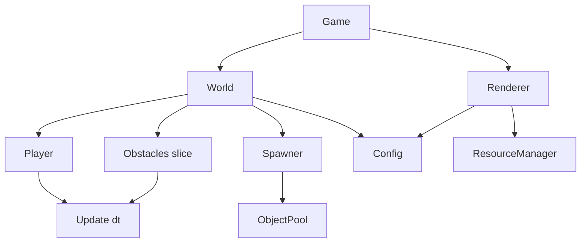
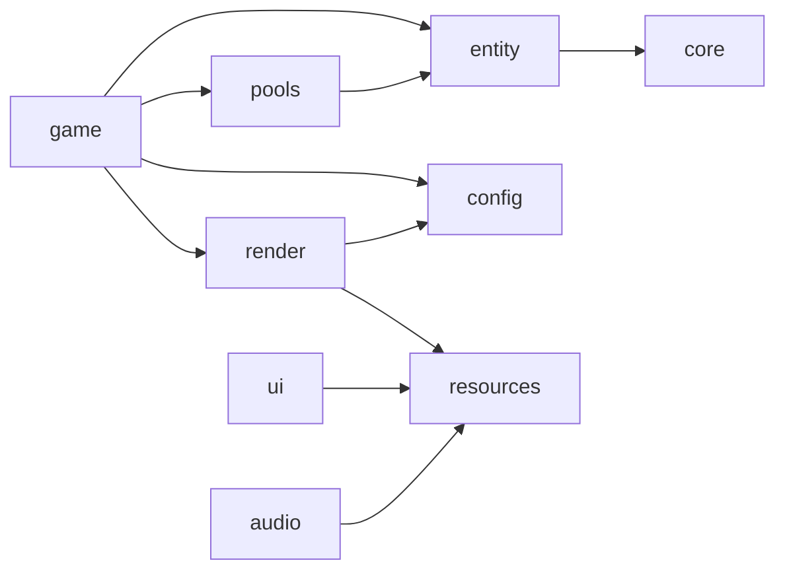

# Технический Дизайн: Рефакторинг Архитектуры "The Fiasko"

## Введение

Данный документ описывает прагматичный технический дизайн рефакторинга псевдо-3D раннера "The Fiasko". Цель рефакторинга — сделать код управляемым, чистым и готовым к расширению, сохранив текущий функционал игры.

**Принцип:** Простота важнее идеальной архитектуры. Никакого overengineering.

### КРИТИЧНЫЕ АРХИТЕКТУРНЫЕ РЕШЕНИЯ

**1. Трёхуровневая архитектура:**
- **Level 1 (Data)**: Player/Obstacle = только данные, без методов
- **Level 2 (Logic)**: Отдельные функции UpdatePlayer(), UpdateObstacle(), etc.
- **Level 3 (Render)**: Renderer отделён от entity, entity не знают о рендеринге

**2. World = Orchestrator, НЕ God Object:**
- Координирует, не выполняет всё сам
- Логика разбита на отдельные функции (updatePlayer, updateObstacles, handleSpawning, handleCollisions, removeOffscreenObstacles, handleInput)
- Каждая функция = одна ответственность
- **World НЕ владеет Renderer** - это делает Game

**3. Game владеет World И Renderer:**
- Game = точка входа, связывает logic и presentation
- World = game logic (игровая логика)
- Renderer = presentation layer (слой представления)
- World НЕ знает о Renderer, предоставляет только данные

**4. Input на уровне World/Game, НЕ в entity_logic:**
- Input = внешний источник (клавиатура), НЕ логика entity
- handleInput() находится в world.go, НЕ в player_logic.go
- Entity logic должна быть чистой, без знания о клавиатуре

**5. Obstacle.Type = enum, НЕ string:**
- ObstacleType как enum (ObstacleTypeLog, ObstacleTypeRock)
- Compile-time проверка типов
- Быстрее сравнение, меньше ошибок

**6. Score tracking:**
- World.score отслеживает прогресс игрока
- Увеличивается в Update: w.score += dt
- Runners нуждаются в score/progression

**7. Критичные исправления:**
- **Spawner**: `timer -= interval` (НЕ `timer = 0`), возвращает `[]*Obstacle` (НЕ `*Obstacle`)
- **ObjectPool**: maxSize ограничение, полный Reset(), НЕТ active флага
- **Collision**: Early-out оптимизация (`if math.Abs(obs.Position.Z - playerZ) > 5.0 { continue }`)
- **Renderer**: Переиспользует буфер sortedObstacles (НЕ создаёт новый каждый кадр)
- **Config**: Добавлены SpawnRangeX, SpawnZ, DespawnZ (НЕ хардкод)
- **dt clamp**: `dt = math.Min(dt, 0.05)` вместо `if dt > 0.1 { dt = 0.1 }`

**8. Тестирование:**
- **Manual testing** (основной метод)
- Простые unit tests (опционально)
- **НЕТ property-based тестов, НЕТ gopter, НЕТ сложных генераторов**

### Текущие Проблемы

1. **God Object**: Game содержит всё (player, obstacles, ui, camera)
2. **World = потенциальный God Object 2.0**: Если World владеет renderer, он становится новым God Object
3. **Tight Coupling**: Player/Obstacle знают о Config, ResourceManager, Camera напрямую
4. **Single Responsibility Violation**: Player делает input, physics, game rules, rendering
5. **Input в entity_logic**: HandlePlayerInput в player_logic.go нарушает разделение (input = внешний источник, не entity logic)
6. **Смешанная логика**: Update и Draw не разделены
7. **Draw зависит от Camera**: Entity.Draw(screen, camera) нарушает архитектурные слои
8. **Obstacle.Type = string**: Слабая типизация, медленное сравнение, нет compile-time проверок
9. **Нет Score tracking**: Runners нуждаются в score/progression
10. **Хардкод**: Магические числа разбросаны по коду (включая -10 для despawn)
11. **dt clamp**: `if dt > 0.1 { dt = 0.1 }` - 0.1 слишком много, лучше 0.05
12. **Нагрузка на GC**: Препятствия создаются/удаляются без переиспользования
13. **Многократная загрузка**: Текстуры загружаются при создании каждого объекта
14. **Хаотичная структура**: Пустые папки, закомментированный код, неиспользуемые геттеры
15. **ObjectPool Issues**: Нет maxSize, есть лишний active флаг, неполный Reset()
16. **Spawner Issues**: timer = 0 вместо timer -= interval, возвращает *Obstacle вместо []*Obstacle
17. **Renderer Allocations**: Создаёт новый sortedObstacles slice каждый кадр, capacity hardcoded 100

### Цели Рефакторинга

**Архитектурные:**
- Разделить Update (логика) и Draw (отрисовка)
- Убрать God Object, создать World как ОРКЕСТРАТОР (не новый God Object)
- **Game владеет World И Renderer** (разделение logic и presentation)
- **World НЕ владеет Renderer** (предотвращает God Object 2.0)
- Разделить Data (структуры) и Logic (функции)
- Вынести Player и Obstacle в отдельные файлы (только данные)
- Отделить Renderer от Entity (Entity не знают о рендеринге)
- **Переместить input handling на уровень World/Game** (НЕ в entity_logic)
- **Изменить Obstacle.Type на enum** (вместо string)
- **Добавить score tracking** в World

**Оптимизации:**
- Добавить простой ObjectPool с maxSize для препятствий
- Добавить простой ResourceManager для текстур
- Исправить Spawner (timer -= interval, возвращать []*Obstacle)
- Переиспользовать буфер sortedObstacles в Renderer
- Добавить early-out в collision detection
- **Улучшить dt clamp** (0.05 вместо 0.1)

**Чистка:**
- Вынести хардкод в Config (включая SpawnRangeX, SpawnZ, DespawnZ)
- Удалить мусорный код
- Удалить active флаг из Obstacle

**Главное:**
- Сохранить текущий функционал игры
- Простота важнее overengineering

## Overview

### Архитектурный Подход

**КРИТИЧНО: Трёхуровневая архитектура с чётким разделением:**

**Level 1 - Data (структуры):**
- Player, Obstacle = ТОЛЬКО данные (Position, Velocity, размеры)
- НЕТ методов, НЕТ зависимостей от Config/ResourceManager/Camera
- Чистые структуры данных
- **Obstacle.Type = enum (ObstacleType), НЕ string**

**Level 2 - Logic (функции):**
- UpdatePlayer(), UpdateObstacle()
- CheckPlayerFall()
- CheckAABBCollision()
- **handleInput() на уровне World** (НЕ HandlePlayerInput в entity_logic)
- Функции принимают данные и Config, возвращают результат
- Без побочных эффектов где возможно

**Level 3 - Rendering (Renderer):**
- Renderer.DrawPlayer(), Renderer.DrawObstacle()
- Entity НЕ знают о рендеринге
- Renderer знает как рисовать entity
- **Game владеет Renderer, НЕ World**

**World = Orchestrator (НЕ God Object):**
- Координирует взаимодействие между компонентами
- Делегирует работу отдельным функциям
- Каждая функция = одна ответственность
- НЕ выполняет всю логику сам
- **НЕ владеет Renderer** (предотвращает God Object 2.0)
- **Отслеживает score** (w.score += dt)

**Game = Entry Point:**
- Владеет World (game logic)
- Владеет Renderer (presentation layer)
- Связывает logic и presentation
- Управляет game state

**Компоненты:**
- **Game**: Точка входа, владеет World и Renderer
- **World**: Оркестратор (player, obstacles, spawner, pool, score)
- **Spawner**: Генерирует препятствия с правильным таймером
- **ObjectPool**: Переиспользует препятствия с maxSize
- **Renderer**: Отрисовка с переиспользуемым буфером
- **ResourceManager**: Загружает текстуры один раз
- **Config**: Хранит все настройки (включая SpawnRangeX, SpawnZ, DespawnZ)

### Ключевые Принципы

1. **Простота**: Никаких ECS, event bus, spatial hash, batch renderer, property-based тестов
2. **Data vs Logic Separation**: Entity = только данные, логика в отдельных функциях
3. **World = Orchestrator**: Координирует, не выполняет всё сам
4. **Game владеет World И Renderer**: Разделение logic и presentation, предотвращает God Object 2.0
5. **Renderer отделён от Entity**: Entity не знают о рендеринге
6. **Input на уровне World/Game**: handleInput в world.go, НЕ в entity_logic
7. **Obstacle.Type = enum**: Compile-time проверка, быстрее сравнение
8. **Score tracking**: World.score отслеживает прогресс
9. **Разделение Update/Draw**: Логика отдельно от отрисовки
10. **Delta time (dt)**: Все Update методы принимают dt float64
11. **Config через конструкторы**: Game → World → Spawner (НЕ глобальные переменные)
12. **Конкретные типы**: НЕ map[string]interface{}
13. **Оптимизации**: Переиспользование буферов, early-out, правильный таймер, улучшенный dt clamp

### Архитектурная Диаграмма



**КРИТИЧНО: Архитектурные принципы:**
- Game владеет World И Renderer (разделение ответственностей)
- World = game logic, Renderer = presentation layer
- World НЕ знает о Renderer
- Input обрабатывается на уровне World (handleInput), НЕ в entity_logic

### Новая Структура Пакетов

```
internal/
├── core/
│   └── vector.go          # Vec3, математические операции
│
├── entity/
│   ├── player.go          # Player структура (ТОЛЬКО данные)
│   ├── obstacle.go        # Obstacle структура (ТОЛЬКО данные)
│   ├── player_logic.go    # UpdatePlayer, HandlePlayerInput, CheckPlayerFall
│   └── obstacle_logic.go  # UpdateObstacle
│
├── game/
│   ├── world.go           # World (оркестратор, НЕ god object)
│   ├── spawner.go         # Spawner (генерирует препятствия)
│   └── collision.go       # CheckAABBCollision
│
├── pools/
│   └── obstacle_pool.go   # ObstaclePool для препятствий
│
├── render/
│   ├── renderer.go        # Renderer (отрисовка, отделён от entity)
│   └── camera.go          # Camera (проекция)
│
├── resources/
│   └── manager.go         # ResourceManager (кэширует текстуры)
│
├── config/
│   └── config.go          # GameConfig (все настройки, включая SpawnRangeX/SpawnZ)
│
├── ui/
│   └── menu.go            # Простой UI (кнопки, текст)
│
└── audio/
    └── sound.go           # SoundManager (прыжок, столкновение, фон)
```

**КРИТИЧНО: Архитектурные принципы:**

1. **Data vs Logic Separation:**
   - `entity/player.go` и `entity/obstacle.go` = ТОЛЬКО данные
   - `entity/player_logic.go` и `entity/obstacle_logic.go` = логика
   - Entity НЕ знают о Config, ResourceManager, Camera
   - **Obstacle.Type = enum (ObstacleType), НЕ string**

2. **World = Orchestrator, NOT God Object:**
   - World координирует, не выполняет всё сам
   - Логика разбита на отдельные функции
   - Каждая функция = одна ответственность
   - **World НЕ владеет Renderer** (предотвращает God Object 2.0)
   - **World отслеживает score** (w.score += dt)

3. **Game владеет World И Renderer:**
   - Game = entry point, связывает logic и presentation
   - World = game logic
   - Renderer = presentation layer
   - Разделение ответственностей

4. **Input на уровне World/Game:**
   - handleInput() в world.go, НЕ в player_logic.go
   - Input = внешний источник (клавиатура), НЕ entity logic
   - Entity logic должна быть чистой

5. **Renderer отделён от Entity:**
   - Entity НЕ имеют методов Draw()
   - Renderer знает как рисовать entity
   - Entity не знают о рендеринге

### Граф Зависимостей



Граф ациклический, зависимости идут только вниз. Renderer изолирован от entity.

## Architecture

### Game Loop

Простой игровой цикл с разделением Update и Draw.

**Структура:**

```go
type GameStateType int

const (
    StateMenu GameStateType = iota
    StatePlaying
    StateGameOver
    StatePaused
)

type Game struct {
    world     *World
    renderer  *Renderer  // КРИТИЧНО: Game владеет renderer, НЕ World
    state     GameStateType
    lastTime  time.Time
}

func (g *Game) Update() error {
    // Вычисляем delta time
    now := time.Now()
    dt := now.Sub(g.lastTime).Seconds()
    g.lastTime = now
    
    // КРИТИЧНО: Ограничиваем dt для стабильности (0.05 вместо 0.1)
    dt = math.Min(dt, 0.05)
    
    // Обрабатываем в зависимости от состояния
    switch g.state {
    case StateMenu:
        // TODO: menu logic
    case StatePlaying:
        g.world.Update(dt)
        if g.world.IsGameOver() {
            g.state = StateGameOver
        }
    case StateGameOver:
        // TODO: game over logic
    case StatePaused:
        // Ничего не обновляем
    }
    
    return nil
}

func (g *Game) Draw(screen *ebiten.Image) {
    switch g.state {
    case StateMenu:
        // TODO: draw menu
    case StatePlaying, StateGameOver:
        // КРИТИЧНО: Game владеет renderer и вызывает его напрямую
        g.renderer.DrawWorld(screen, g.world.player, g.world.obstacles)
        // TODO: Draw score overlay using g.world.score
        if g.state == StateGameOver {
            // TODO: draw game over overlay
        }
    case StatePaused:
        g.renderer.DrawWorld(screen, g.world.player, g.world.obstacles)
        // TODO: draw pause overlay
    }
}
```

**Принципы:**
- Update содержит ТОЛЬКО логику (позиции, скорости, коллизии)
- Draw содержит ТОЛЬКО отрисовку
- Draw НЕ изменяет состояние игры
- Все Update методы принимают dt float64
- dt вычисляется как время между кадрами в секундах
- Game state управляется на уровне Game, а не через error

### World

World управляет игровыми объектами. **КРИТИЧНО**: World — это ОРКЕСТРАТОР, не God Object. Логика разбита на отдельные функции для упрощения и соблюдения Single Responsibility Principle.

**КРИТИЧНО: World НЕ владеет Renderer!**
- World = game logic (игровая логика)
- Renderer = presentation layer (слой представления)
- Связь через Game, который владеет обоими

**Структура:**

```go
type GameState int

const (
    StatePlaying GameState = iota
    StateGameOver
)

type World struct {
    player    *Player
    obstacles []*Obstacle
    spawner   *Spawner
    pool      *ObstaclePool
    config    *Config
    state     GameState
    score     float64  // КРИТИЧНО: Добавлен score tracking
    // КРИТИЧНО: НЕТ renderer - World не знает о рендеринге!
}

func NewWorld(config *Config, pool *ObstaclePool) *World {
    return &World{
        player:    NewPlayer(),
        obstacles: make([]*Obstacle, 0, config.MaxObstacles),  // КРИТИЧНО: Используем config.MaxObstacles
        spawner:   NewSpawner(config, pool),
        pool:      pool,
        config:    config,
        state:     StatePlaying,
        score:     0,
    }
}
```

**Update логика (разбита на отдельные функции - World как ОРКЕСТРАТОР):**

```go
func (w *World) Update(dt float64) {
    if w.state != StatePlaying {
        return
    }
    
    // World ОРКЕСТРИРУЕТ, не выполняет всю логику сам
    // 1. Input handling (КРИТИЧНО: на уровне World, НЕ в entity_logic)
    handleInput(w, dt)
    
    // 2. Physics updates
    updatePlayer(w, dt)
    updateObstacles(w, dt)
    
    // 3. Spawning
    handleSpawning(w, dt)
    
    // 4. Collisions (с early-out оптимизацией)
    if handleCollisions(w) {
        w.state = StateGameOver
        return
    }
    
    // 5. Cleanup
    removeOffscreenObstacles(w)
    
    // 6. Game rules
    if CheckPlayerFall(w.player, w.config) {
        w.state = StateGameOver
        return
    }
    
    // 7. Score tracking (КРИТИЧНО: увеличиваем score)
    w.score += dt
}

// КРИТИЧНО: Input handling на уровне World/Game, НЕ в entity logic
// Input = внешний источник (клавиатура), НЕ логика entity
func handleInput(w *World, dt float64) {
    // Балансирование
    if ebiten.IsKeyPressed(ebiten.KeyA) {
        w.player.Balance -= w.config.BalanceSpeed * dt
    }
    if ebiten.IsKeyPressed(ebiten.KeyD) {
        w.player.Balance += w.config.BalanceSpeed * dt
    }
    
    // Прыжок
    if ebiten.IsKeyPressed(ebiten.KeyW) && w.player.Velocity.Y == 0 {
        w.player.Velocity.Y = w.config.JumpVelocity
    }
}

// Отдельные функции для каждой ответственности
func updatePlayer(w *World, dt float64) {
    UpdatePlayer(w.player, w.config, dt)
}

func updateObstacles(w *World, dt float64) {
    for _, obs := range w.obstacles {
        UpdateObstacle(obs, dt)
    }
}

func handleSpawning(w *World, dt float64) {
    newObstacles := w.spawner.Update(dt)
    for _, obs := range newObstacles {
        if len(w.obstacles) < w.config.MaxObstacles {
            w.obstacles = append(w.obstacles, obs)
        } else {
            w.pool.Put(obs)
        }
    }
}

func handleCollisions(w *World) bool {
    playerZ := w.player.Position.Z
    
    for _, obs := range w.obstacles {
        // КРИТИЧНО: Early-out оптимизация - пропускаем далёкие объекты
        if math.Abs(obs.Position.Z - playerZ) > 5.0 {
            continue
        }
        
        if CheckAABBCollision(w.player, obs) {
            return true
        }
    }
    return false
}

func removeOffscreenObstacles(w *World) {
    i := 0
    for _, obs := range w.obstacles {
        // КРИТИЧНО: Используем config.DespawnZ вместо магического числа -10
        if obs.Position.Z < w.config.DespawnZ {
            w.pool.Put(obs)
        } else {
            w.obstacles[i] = obs
            i++
        }
    }
    w.obstacles = w.obstacles[:i]
}

func (w *World) IsGameOver() bool {
    return w.state == StateGameOver
}
```

**Draw НЕ принадлежит World:**

```go
// КРИТИЧНО: World НЕ имеет метода Draw()
// Рендеринг выполняется через Game, который владеет Renderer
// World предоставляет только данные для рендеринга
```
```

**Collision detection (отдельная функция):**

```go
func CheckAABBCollision(player *Player, obs *Obstacle) bool {
    px, py, pz := player.Position.X, player.Position.Y, player.Position.Z
    ox, oy, oz := obs.Position.X, obs.Position.Y, obs.Position.Z
    
    return math.Abs(px-ox) < (player.Width+obs.Width)/2 &&
           math.Abs(py-oy) < (player.Height+obs.Height)/2 &&
           math.Abs(pz-oz) < (player.Depth+obs.Depth)/2
}
```

### Player

**КРИТИЧНО: Разделение на уровни (Data vs Logic)**

**Level 1 - Data Only (структура):**

```go
type Player struct {
    // Только данные, никакой логики
    Position  Vec3
    Velocity  Vec3
    Balance   float64
    Width     float64
    Height    float64
    Depth     float64
}

func NewPlayer() *Player {
    return &Player{
        Position: Vec3{X: 0, Y: 0, Z: 0},
        Velocity: Vec3{},
        Balance:  0,
        Width:    2.0,
        Height:   3.0,
        Depth:    1.0,
    }
}
```

**Level 2 - Logic (отдельные функции в player_logic.go):**

```go
// UpdatePlayer обновляет физику игрока
func UpdatePlayer(p *Player, config *Config, dt float64) {
    // 1. Применяем гравитацию
    if p.Position.Y > 0 {
        p.Velocity.Y -= config.Gravity * dt
    }
    
    // 2. Обновляем позицию
    p.Position.X += p.Velocity.X * dt
    p.Position.Y += p.Velocity.Y * dt
    p.Position.Z += p.Velocity.Z * dt
    
    // 3. Ограничиваем позицию
    if p.Position.Y < 0 {
        p.Position.Y = 0
        p.Velocity.Y = 0
    }
}

// КРИТИЧНО: HandlePlayerInput УДАЛЁН из entity_logic
// Input обрабатывается на уровне World/Game (см. handleInput в world.go)
// Entity logic должна быть чистой, без знания о клавиатуре

// CheckPlayerFall проверяет условие падения (game rule)
func CheckPlayerFall(p *Player, config *Config) bool {
    return math.Abs(p.Balance) > config.MaxBalance
}
```

**Почему это важно:**
- Player = чистые данные, никакой логики
- Логика вынесена в отдельные функции
- Нет зависимостей от Config, ResourceManager, Camera в структуре
- Легко тестировать, легко расширять

### Obstacle

**КРИТИЧНО: Только данные, логика отдельно, Type = enum**

**Level 1 - Data Only (структура):**

```go
// КРИТИЧНО: ObstacleType как enum, НЕ string
type ObstacleType int

const (
    ObstacleTypeLog ObstacleType = iota
    ObstacleTypeRock
    // Будущие типы можно добавить здесь
)

type Obstacle struct {
    // Только данные
    Position Vec3
    Velocity Vec3
    Width    float64
    Height   float64
    Depth    float64
    Type     ObstacleType  // КРИТИЧНО: enum, НЕ string
    // КРИТИЧНО: НЕТ active флага - состояние контролируется присутствием в world.obstacles
}

func (o *Obstacle) Reset() {
    o.Position = Vec3{}
    o.Velocity = Vec3{}
    o.Type = ObstacleTypeLog  // Сброс в дефолтное значение
    // Полный сброс всех полей
}
```

**Level 2 - Logic (отдельная функция в obstacle_logic.go):**

```go
// UpdateObstacle обновляет позицию препятствия
func UpdateObstacle(o *Obstacle, dt float64) {
    // Препятствия движутся к игроку
    o.Position.Z -= o.Velocity.Z * dt
}
```

**КРИТИЧНО: Почему НЕТ active флага:**
- Состояние "активен/неактивен" контролируется присутствием в `world.obstacles` slice
- Если препятствие в slice → активно
- Если препятствие в pool → неактивно
- Это упрощает логику и убирает дублирование состояния

### Spawner

**КРИТИЧНО: Правильная обработка таймера и burst spawn**

Генерирует препятствия с таймером. Использует Config для всех параметров.

**Структура:**

```go
type Spawner struct {
    timer    float64
    interval float64
    pool     *ObstaclePool
    config   *Config
}

func NewSpawner(config *Config, pool *ObstaclePool) *Spawner {
    return &Spawner{
        timer:    0,
        interval: config.SpawnInterval,
        pool:     pool,
        config:   config,
    }
}
```

**Update логика (КРИТИЧНО - правильная обработка таймера):**

```go
func (s *Spawner) Update(dt float64) []*Obstacle {
    s.timer += dt
    
    spawned := make([]*Obstacle, 0, 2)
    
    // КРИТИЧНО: Используем цикл for и timer -= interval
    // НЕ timer = 0! Это сохраняет точность таймера
    for s.timer >= s.interval {
        s.timer -= s.interval  // Вычитаем интервал, НЕ обнуляем!
        
        // Получаем препятствие из пула
        obs := s.pool.Get()
        
        // КРИТИЧНО: Инициализируем позицию из Config (НЕ хардкод)
        obs.Position = Vec3{
            X: (rand.Float64() - 0.5) * s.config.SpawnRangeX,
            Y: 0,
            Z: s.config.SpawnZ,
        }
        obs.Velocity = Vec3{Z: s.config.ObstacleSpeed}
        obs.Type = ObstacleTypeLog  // КРИТИЧНО: Используем enum, НЕ string
        
        spawned = append(spawned, obs)
    }
    
    return spawned  // КРИТИЧНО: Возвращаем []*Obstacle, НЕ *Obstacle
}
```

**Почему это КРИТИЧНО:**

1. **`timer -= interval` вместо `timer = 0`:**
   - Сохраняет точность таймера
   - Если dt = 2.1 и interval = 1.0, должно заспавниться 2 препятствия
   - С `timer = 0` потеряем 0.1 секунды каждый раз
   - С `timer -= interval` точность сохраняется

2. **Возвращаем `[]*Obstacle` вместо `*Obstacle`:**
   - Поддерживает burst spawn при больших dt (лаги)
   - Если игра зависла на 5 секунд, должно заспавниться несколько препятствий сразу

3. **Используем Config для SpawnRangeX и SpawnZ:**
   - Никакого хардкода
   - Легко настраивать

### ObjectPool

**КРИТИЧНО: Ограничение размера и полный сброс**

Простой пул с ограничением размера для предотвращения бесконечного роста.

**Структура:**

```go
type ObstaclePool struct {
    obstacles []*Obstacle
    maxSize   int  // КРИТИЧНО: Ограничение размера пула
}

func NewObstaclePool(maxSize int) *ObstaclePool {
    return &ObstaclePool{
        obstacles: make([]*Obstacle, 0, maxSize),
        maxSize:   maxSize,
    }
}
```

**Методы:**

```go
func (p *ObstaclePool) Get() *Obstacle {
    if len(p.obstacles) > 0 {
        // Берём из пула
        obs := p.obstacles[len(p.obstacles)-1]
        p.obstacles = p.obstacles[:len(p.obstacles)-1]
        return obs
    }
    
    // Пул пуст, создаём новое
    return &Obstacle{
        Width:  2.0,
        Height: 2.0,
        Depth:  2.0,
    }
}

func (p *ObstaclePool) Put(obs *Obstacle) {
    // КРИТИЧНО: Полностью сбрасываем состояние
    obs.Reset()
    
    // КРИТИЧНО: Возвращаем в пул только если не превышен лимит
    if len(p.obstacles) < p.maxSize {
        p.obstacles = append(p.obstacles, obs)
    }
    // Иначе просто отбрасываем (GC соберёт)
}
```

**Почему это КРИТИЧНО:**

1. **maxSize ограничение:**
   - Предотвращает бесконечный рост пула
   - Если игра долго работает, пул не займёт всю память
   - Баланс между переиспользованием и памятью

2. **Полный Reset():**
   - Сбрасывает ВСЕ поля (Position, Velocity, Type)
   - Предотвращает утечку состояния между использованиями
   - Препятствие из пула = как новое

3. **НЕТ active флага:**
   - Состояние контролируется присутствием в world.obstacles
   - Упрощает логику

### ResourceManager

Простой менеджер для загрузки текстур один раз.

**Структура:**

```go
type ResourceManager struct {
    images map[string]*ebiten.Image
}

func NewResourceManager() *ResourceManager {
    return &ResourceManager{
        images: make(map[string]*ebiten.Image),
    }
}
```

**Методы:**

```go
func (r *ResourceManager) LoadImage(path string) (*ebiten.Image, error) {
    // Проверяем кэш
    if img, ok := r.images[path]; ok {
        return img, nil
    }
    
    // Загружаем файл
    file, err := os.Open(path)
    if err != nil {
        log.Println("Failed to load image:", path, err)
        return nil, err
    }
    defer file.Close()
    
    // Декодируем
    img, _, err := image.Decode(file)
    if err != nil {
        log.Println("Failed to decode image:", path, err)
        return nil, err
    }
    
    // Создаём Ebiten Image
    ebitenImg := ebiten.NewImageFromImage(img)
    
    // Кэшируем
    r.images[path] = ebitenImg
    log.Println("Loaded image:", path)
    
    return ebitenImg, nil
}
```

### Config

**КРИТИЧНО: Добавлены SpawnRangeX и SpawnZ**

Конфигурация игры с значениями по умолчанию. Разделена на логические группы.

**Структура:**

```go
type Config struct {
    // Игра
    ScreenWidth  int
    ScreenHeight int
    TargetFPS    int
    
    // Физика
    Gravity      float64
    JumpVelocity float64
    
    // Игрок
    BalanceSpeed float64
    MaxBalance   float64
    
    // Спавн (КРИТИЧНО: добавлены SpawnRangeX и SpawnZ)
    SpawnInterval  float64
    SpawnRangeX    float64  // КРИТИЧНО: Диапазон X для спавна (НЕ хардкод)
    SpawnZ         float64  // КРИТИЧНО: Z позиция спавна (НЕ хардкод)
    ObstacleSpeed  float64
    MaxObstacles   int
    DespawnZ       float64  // КРИТИЧНО: Z позиция удаления (вместо магического -10)
    
    // Камера
    CameraFocalLength float64
    CameraHorizonY    float64
}

func DefaultConfig() *Config {
    return &Config{
        ScreenWidth:       800,
        ScreenHeight:      600,
        TargetFPS:         60,
        Gravity:           20.0,
        JumpVelocity:      10.0,
        BalanceSpeed:      5.0,
        MaxBalance:        10.0,
        SpawnInterval:     2.0,
        SpawnRangeX:       10.0,  // КРИТИЧНО: Добавлено
        SpawnZ:            50.0,  // КРИТИЧНО: Добавлено
        ObstacleSpeed:     5.0,
        MaxObstacles:      20,
        DespawnZ:          -10.0, // КРИТИЧНО: Добавлено (вместо хардкода)
        CameraFocalLength: 300.0,
        CameraHorizonY:    300.0,
    }
}
```

**Передача через конструкторы:**

```go
// main.go
config := config.DefaultConfig()
pool := pools.NewObstaclePool(config.MaxObstacles)
resMgr := resources.NewResourceManager()
renderer := render.NewRenderer(config, resMgr)
world := game.NewWorld(config, pool)  // КРИТИЧНО: World НЕ получает renderer
g := &Game{
    world:    world,
    renderer: renderer,  // КРИТИЧНО: Game владеет renderer
    lastTime: time.Now(),
}
```

**Возможное расширение (опционально):**

Если Config станет слишком большим, можно разделить:

```go
type PhysicsConfig struct {
    Gravity      float64
    JumpVelocity float64
}

type SpawnConfig struct {
    Interval  float64
    RangeX    float64
    SpawnZ    float64
    Speed     float64
    MaxCount  int
}

type Config struct {
    Screen  ScreenConfig
    Physics PhysicsConfig
    Spawn   SpawnConfig
    Camera  CameraConfig
}
```

Но пока это не нужно - простая структура достаточна.

## Components and Interfaces

Все компоненты — это простые структуры или функции. Никаких сложных интерфейсов.

### Camera

Существующая логика проекции 3D → 2D сохраняется.

**Структура:**

```go
type Camera struct {
    Position    Vec3
    FocalLength float64
    HorizonY    float64
    ScreenW     float64
    ScreenH     float64
}

func NewCamera(config *Config) *Camera {
    return &Camera{
        Position:    Vec3{X: 0, Y: 5, Z: -10},
        FocalLength: config.CameraFocalLength,
        HorizonY:    config.CameraHorizonY,
        ScreenW:     float64(config.ScreenWidth),
        ScreenH:     float64(config.ScreenHeight),
    }
}

func (c *Camera) Project(point Vec3) (float64, float64, float64) {
    // Существующая логика проекции
    relX := point.X - c.Position.X
    relY := point.Y - c.Position.Y
    relZ := point.Z - c.Position.Z
    
    // Проверяем, что точка перед камерой
    if relZ <= 0 {
        return 0, 0, 0
    }
    
    // Перспективная проекция
    scale := c.FocalLength / relZ
    screenX := c.ScreenW/2 + relX*scale
    screenY := c.HorizonY - relY*scale
    
    return screenX, screenY, scale
}
```

### Renderer

**КРИТИЧНО: Отделён от entity, переиспользует буфер, владеется Game**

Отдельный компонент для рендеринга, полностью отделённый от entity. Entity НЕ знают о рендеринге. **Game владеет Renderer, НЕ World.**

**Структура:**

```go
type Renderer struct {
    camera  *Camera
    resMgr  *ResourceManager
    
    // Кэшированные текстуры
    playerTexture   *ebiten.Image
    obstacleTexture *ebiten.Image
    
    // КРИТИЧНО: Переиспользуемый буфер для сортировки (избегаем allocation каждый кадр)
    sortedObstacles []*Obstacle
}

func NewRenderer(config *Config, resMgr *ResourceManager) *Renderer {
    // Preload критических текстур
    playerTex, err := resMgr.LoadImage("internal/asset/image/dog_texture.png")
    if err != nil {
        log.Fatal("Failed to load player texture:", err)
    }
    
    obstacleTex, err := resMgr.LoadImage("internal/asset/image/log_texture.jpg")
    if err != nil {
        log.Fatal("Failed to load obstacle texture:", err)
    }
    
    return &Renderer{
        camera:           NewCamera(config),
        resMgr:           resMgr,
        playerTexture:    playerTex,
        obstacleTexture:  obstacleTex,
        sortedObstacles:  make([]*Obstacle, 0, config.MaxObstacles),  // КРИТИЧНО: Используем config.MaxObstacles
    }
}

func (r *Renderer) DrawWorld(screen *ebiten.Image, player *Player, obstacles []*Obstacle) {
    // КРИТИЧНО: Переиспользуем буфер вместо создания нового slice
    r.sortedObstacles = r.sortedObstacles[:0]  // Сбрасываем длину, сохраняем capacity
    r.sortedObstacles = append(r.sortedObstacles, obstacles...)
    
    // Сортируем по глубине (painter's algorithm)
    sort.Slice(r.sortedObstacles, func(i, j int) bool {
        return r.sortedObstacles[i].Position.Z > r.sortedObstacles[j].Position.Z
    })
    
    // Рисуем препятствия (дальние первыми)
    for _, obs := range r.sortedObstacles {
        r.DrawObstacle(screen, obs)
    }
    
    // Рисуем игрока
    r.DrawPlayer(screen, player)
}

func (r *Renderer) DrawPlayer(screen *ebiten.Image, p *Player) {
    sx, sy, scale := r.camera.Project(p.Position)
    
    // Проверяем, что объект перед камерой
    if scale <= 0 {
        return
    }
    
    w := p.Width * scale
    h := p.Height * scale
    
    vertices := []ebiten.Vertex{
        {DstX: float32(sx - w/2), DstY: float32(sy - h), SrcX: 0, SrcY: 0, ColorR: 1, ColorG: 1, ColorB: 1, ColorA: 1},
        {DstX: float32(sx + w/2), DstY: float32(sy - h), SrcX: float32(r.playerTexture.Bounds().Dx()), SrcY: 0, ColorR: 1, ColorG: 1, ColorB: 1, ColorA: 1},
        {DstX: float32(sx - w/2), DstY: float32(sy), SrcX: 0, SrcY: float32(r.playerTexture.Bounds().Dy()), ColorR: 1, ColorG: 1, ColorB: 1, ColorA: 1},
        {DstX: float32(sx + w/2), DstY: float32(sy), SrcX: float32(r.playerTexture.Bounds().Dx()), SrcY: float32(r.playerTexture.Bounds().Dy()), ColorR: 1, ColorG: 1, ColorB: 1, ColorA: 1},
    }
    
    indices := []uint16{0, 1, 2, 1, 2, 3}
    screen.DrawTriangles(vertices, indices, r.playerTexture, nil)
}

func (r *Renderer) DrawObstacle(screen *ebiten.Image, o *Obstacle) {
    sx, sy, scale := r.camera.Project(o.Position)
    
    // Проверяем, что объект перед камерой
    if scale <= 0 {
        return
    }
    
    w := o.Width * scale
    h := o.Height * scale
    
    vertices := []ebiten.Vertex{
        {DstX: float32(sx - w/2), DstY: float32(sy - h), SrcX: 0, SrcY: 0, ColorR: 1, ColorG: 1, ColorB: 1, ColorA: 1},
        {DstX: float32(sx + w/2), DstY: float32(sy - h), SrcX: float32(r.obstacleTexture.Bounds().Dx()), SrcY: 0, ColorR: 1, ColorG: 1, ColorB: 1, ColorA: 1},
        {DstX: float32(sx - w/2), DstY: float32(sy), SrcX: 0, SrcY: float32(r.obstacleTexture.Bounds().Dy()), ColorR: 1, ColorG: 1, ColorB: 1, ColorA: 1},
        {DstX: float32(sx + w/2), DstY: float32(sy), SrcX: float32(r.obstacleTexture.Bounds().Dx()), SrcY: float32(r.obstacleTexture.Bounds().Dy()), ColorR: 1, ColorG: 1, ColorB: 1, ColorA: 1},
    }
    
    indices := []uint16{0, 1, 2, 1, 2, 3}
    screen.DrawTriangles(vertices, indices, r.obstacleTexture, nil)
}
```

**Почему это КРИТИЧНО:**

1. **Entity НЕ знают о рендеринге:**
   - Player/Obstacle = только данные
   - НЕТ методов Draw(screen, camera)
   - Renderer знает как рисовать, entity не знают

2. **Переиспользование буфера sortedObstacles:**
   - НЕ создаём новый slice каждый кадр
   - Используем `sortedObstacles[:0]` для сброса длины
   - Сохраняем capacity, избегаем allocation
   - Значительно снижает нагрузку на GC

3. **Архитектурное разделение:**
   - Renderer = Level 3 (рендеринг)
   - Entity = Level 1 (данные)
   - Логика = Level 2 (функции)
   - Чистое разделение ответственностей

### UI

Простой UI без фреймворков.

**Структура:**

```go
type MenuUI struct {
    buttons []Button
}

type Button struct {
    X, Y, W, H float64
    Text       string
    OnClick    func()
}

func (m *MenuUI) Update() {
    if ebiten.IsMouseButtonPressed(ebiten.MouseButtonLeft) {
        mx, my := ebiten.CursorPosition()
        for _, btn := range m.buttons {
            if mx >= int(btn.X) && mx <= int(btn.X+btn.W) &&
               my >= int(btn.Y) && my <= int(btn.Y+btn.H) {
                btn.OnClick()
            }
        }
    }
}

func (m *MenuUI) Draw(screen *ebiten.Image) {
    for _, btn := range m.buttons {
        // Рисуем прямоугольник кнопки
        ebitenutil.DrawRect(screen, btn.X, btn.Y, btn.W, btn.H, color.RGBA{100, 100, 100, 255})
        
        // Рисуем текст
        ebitenutil.DebugPrintAt(screen, btn.Text, int(btn.X+10), int(btn.Y+10))
    }
}
```

### SoundManager

Простой менеджер звуков.

**Структура:**

```go
type SoundManager struct {
    sounds map[string]*audio.Player
    resMgr *ResourceManager
}

func NewSoundManager(resMgr *ResourceManager) *SoundManager {
    return &SoundManager{
        sounds: make(map[string]*audio.Player),
        resMgr: resMgr,
    }
}

func (s *SoundManager) LoadSound(name string, path string) error {
    // Загружаем аудио файл
    file, err := os.Open(path)
    if err != nil {
        return err
    }
    defer file.Close()
    
    // Декодируем
    stream, err := wav.Decode(audioContext, file)
    if err != nil {
        return err
    }
    
    // Создаём player
    player, err := audio.NewPlayer(audioContext, stream)
    if err != nil {
        return err
    }
    
    // Сохраняем
    s.sounds[name] = player
    return nil
}

func (s *SoundManager) Play(name string) {
    if player, ok := s.sounds[name]; ok {
        player.Rewind()
        player.Play()
    }
}
```

## Data Models

### Core Data Structures

#### Vec3

```go
type Vec3 struct {
    X, Y, Z float64
}

func (v Vec3) Add(other Vec3) Vec3 {
    return Vec3{X: v.X + other.X, Y: v.Y + other.Y, Z: v.Z + other.Z}
}

func (v Vec3) Sub(other Vec3) Vec3 {
    return Vec3{X: v.X - other.X, Y: v.Y - other.Y, Z: v.Z - other.Z}
}

func (v Vec3) Scale(s float64) Vec3 {
    return Vec3{X: v.X * s, Y: v.Y * s, Z: v.Z * s}
}

func (v Vec3) Length() float64 {
    return math.Sqrt(v.X*v.X + v.Y*v.Y + v.Z*v.Z)
}

func (v Vec3) Normalize() Vec3 {
    length := v.Length()
    if length == 0 {
        return Vec3{}
    }
    return Vec3{X: v.X / length, Y: v.Y / length, Z: v.Z / length}
}
```

### Game Data Models

Все модели — это простые структуры с конкретными типами полей.

**Принципы:**
- НЕ используем map[string]interface{}
- НЕ используем reflect
- Все поля — конкретные типы (float64, string, *ebiten.Image)
- Простые методы Update(dt) и Draw(screen, camera)

**Пример структуры данных:**

```go
type GameState struct {
    Score       int
    HighScore   int
    Lives       int
    IsGameOver  bool
    IsPaused    bool
}
```

## Key Behaviors to Validate

Ключевые поведения, которые нужно проверить вручную (manual testing) и простыми unit тестами:

### 1. Update/Draw Separation
- Draw не изменяет состояние игры
- Update не работает с изображениями
- Проверка: запустить игру, убедиться что логика и рендеринг разделены

### 2. Delta Time Independence
- Игра работает одинаково при разных FPS
- Движение пропорционально dt
- Проверка: запустить игру, проверить плавность движения

### 3. Object Pool Lifecycle
- Препятствия переиспользуются
- Состояние сбрасывается при возврате в пул
- Пул не растёт бесконечно (maxSize работает)
- Проверка: unit test для переиспользования

### 4. Resource Caching
- Каждая текстура загружается один раз
- Повторные вызовы LoadImage возвращают кэшированную версию
- Проверка: unit test для кэширования, проверить логи

### 5. Collision Detection
- AABB коллизии обнаруживаются корректно
- Early-out оптимизация работает (пропускает далёкие объекты)
- Game over срабатывает при столкновении
- Проверка: запустить игру, врезаться в препятствие

### 6. Spawner Behavior
- Препятствия спавнятся с заданной частотой
- Таймер работает правильно (timer -= interval, не timer = 0)
- Burst spawn работает при больших dt
- Лимит MaxObstacles соблюдается
- Проверка: unit test для таймера, запустить игру

### 7. Renderer Optimization
- sortedObstacles буфер переиспользуется (нет allocation каждый кадр)
- Проверка: профилировать через pprof если нужно

### 8. Backward Compatibility
- Балансирование работает как раньше
- Прыжки работают как раньше
- Управление работает как раньше
- Game over условия работают как раньше
- Проверка: запустить игру, сравнить с оригиналом

## Error Handling

### Error Handling Strategy

**Принцип:** Fail fast для критических ошибок, graceful degradation для некритических.

### Resource Loading Errors

**Критические ошибки (fail fast):**
- Отсутствие текстуры игрока → panic при инициализации
- Отсутствие основных текстур препятствий → panic при инициализации
- Невозможность создать окно → panic при запуске

**Обработка:**

```go
func NewPlayer(config *Config, resMgr *ResourceManager) *Player {
    texture, err := resMgr.LoadImage("internal/asset/image/dog_texture.png")
    if err != nil {
        log.Fatal("Failed to load player texture:", err)
    }
    // ...
}
```

**Некритические ошибки (graceful degradation):**
- Отсутствие звуковых файлов → игра продолжается без звука
- Отсутствие дополнительных текстур → используется placeholder

**Обработка:**

```go
func (s *SoundManager) LoadSound(name string, path string) error {
    // ...
    if err != nil {
        log.Println("Warning: Failed to load sound:", name, err)
        return err  // Не паникуем, просто логируем
    }
    return nil
}
```

### Runtime Errors

**Collision Detection:**
- Некорректные AABB координаты → логируем warning, пропускаем проверку
- NaN в позициях → логируем error, сбрасываем объект

**Spawner:**
- Пул пуст и не может создать новое препятствие → логируем warning, пропускаем спавн
- Превышен лимит препятствий → возвращаем объект в пул

**Camera Projection:**
- Точка за камерой (relZ <= 0) → возвращаем (0, 0, 0), не рисуем объект
- Деление на ноль → проверяем перед делением

### Logging Strategy

**Уровни логирования:**

```go
const DEBUG = false  // Флаг для включения/выключения debug логов

func logDebug(msg string) {
    if DEBUG {
        log.Println("[DEBUG]", msg)
    }
}

func logInfo(msg string) {
    log.Println("[INFO]", msg)
}

func logWarning(msg string) {
    log.Println("[WARNING]", msg)
}

func logError(msg string) {
    log.Println("[ERROR]", msg)
}
```

**Что логируем:**
- INFO: Загрузка ресурсов, инициализация систем
- WARNING: Некритические ошибки (отсутствие звуков, пропуск спавна)
- ERROR: Критические ошибки перед panic
- DEBUG: Детальная информация (позиции объектов, коллизии, таймеры)

## Testing Strategy

### Прагматичный подход к тестированию

**КРИТИЧНО: Для игры достаточно простой стратегии тестирования. НЕТ property-based тестов, НЕТ gopter, НЕТ сложных генераторов.**

**1. Manual Testing (ОСНОВНОЙ метод)**
- Запускаем игру после каждого изменения
- Проверяем геймплей вручную
- Тестируем edge cases интерактивно
- Это ГЛАВНЫЙ способ валидации для игры

**2. Простые Unit Tests (опционально, для критической логики)**
- Только для математики и базовых утилит
- Без сложных фреймворков
- Быстрые и понятные
- НЕ обязательны, но полезны

**3. Smoke Tests**
- Игра запускается без ошибок
- Основные механики работают
- Нет очевидных багов

### Минимальные Unit Tests (опционально)

Тестируем только критическое, БЕЗ property-based тестов:

```go
// Vec3 математика
func TestVec3Add(t *testing.T) {
    v1 := Vec3{X: 1, Y: 2, Z: 3}
    v2 := Vec3{X: 4, Y: 5, Z: 6}
    result := v1.Add(v2)
    
    if result.X != 5 || result.Y != 7 || result.Z != 9 {
        t.Errorf("Expected (5,7,9), got (%f,%f,%f)", result.X, result.Y, result.Z)
    }
}

// ResourceManager кэширование
func TestResourceManagerCaching(t *testing.T) {
    rm := NewResourceManager()
    
    img1, _ := rm.LoadImage("test.png")
    img2, _ := rm.LoadImage("test.png")
    
    if img1 != img2 {
        t.Error("Expected same image instance")
    }
}

// ObjectPool переиспользование
func TestObstaclePoolReuse(t *testing.T) {
    pool := NewObstaclePool(10)
    
    obs1 := pool.Get()
    pool.Put(obs1)
    obs2 := pool.Get()
    
    if obs1 != obs2 {
        t.Error("Expected same obstacle instance")
    }
}

// Spawner таймер
func TestSpawnerTiming(t *testing.T) {
    config := DefaultConfig()
    pool := NewObstaclePool(10)
    spawner := NewSpawner(config, pool)
    
    // До интервала
    result := spawner.Update(0.5)
    if len(result) != 0 {
        t.Error("Should not spawn before interval")
    }
    
    // После интервала
    result = spawner.Update(1.6)
    if len(result) == 0 {
        t.Error("Should spawn after interval")
    }
}
```

### Test Organization

```
internal/
├── core/
│   └── vector_test.go       # Только базовая математика
├── pools/
│   └── obstacle_pool_test.go  # Только переиспользование
├── resources/
│   └── manager_test.go      # Только кэширование
└── game/
    └── spawner_test.go      # Только таймер
```

### Running Tests

```bash
# Все тесты
go test ./...

# С покрытием
go test ./... -cover

# Verbose
go test ./... -v
```

### Validation Checklist

**ГЛАВНЫЙ метод валидации - ручное тестирование. После каждого этапа:**

- [ ] Игра запускается без ошибок
- [ ] FPS стабильный (60 fps)
- [ ] Управление отзывчивое (A/D/W)
- [ ] Балансирование работает
- [ ] Прыжки работают
- [ ] Препятствия спавнятся
- [ ] Коллизии обнаруживаются
- [ ] Game over срабатывает
- [ ] Текстуры загружаются
- [ ] Звуки воспроизводятся
- [ ] Нет утечек памяти (проверить через pprof если нужно)

**Почему НЕТ property-based тестов:**
- Для игры manual testing достаточен и эффективнее
- Property-based тесты = overengineering для этого проекта
- Простота важнее формальной корректности
- Gopter, генераторы, 100 итераций - избыточная сложность

## Implementation Plan

### Phase 1: Stabilization (3-4 days)

**Day 1: Core Structures**
- Создать `internal/core/vector.go` с Vec3
- Создать `internal/config/config.go` с DefaultConfig()
- **КРИТИЧНО**: Добавить в Config: SpawnRangeX, SpawnZ, DespawnZ
- Создать `internal/entity/player.go` с простой структурой Player (только данные)
- **КРИТИЧНО**: Создать `internal/entity/obstacle.go` с ObstacleType enum и структурой Obstacle
- Написать unit тесты для Vec3 операций

**Day 2: World and Game Loop**
- Создать `internal/game/world.go` с World структурой
- **КРИТИЧНО**: World НЕ содержит renderer, содержит score
- Реализовать World.Update(dt) с обновлением player и obstacles
- **КРИТИЧНО**: World НЕ имеет метода Draw()
- Обновить Game структуру для владения World И Renderer
- Добавить GameStateType и управление состояниями
- Добавить вычисление dt в Game.Update()
- **КРИТИЧНО**: Использовать `dt = math.Min(dt, 0.05)` вместо `if dt > 0.1`
- Написать unit тесты для World

**Day 3: Update/Draw Separation**
- Переместить всю логику из Draw в Update
- Убедиться, что Draw не изменяет состояние
- Добавить dt параметр во все Update методы
- Реализовать UpdatePlayer(dt) с обработкой физики
- **КРИТИЧНО**: Реализовать handleInput() в world.go (НЕ HandlePlayerInput в player_logic.go)
- Реализовать UpdateObstacle(dt)
- **КРИТИЧНО**: Добавить score tracking (w.score += dt)
- Написать тесты для Draw idempotence и dt scaling

**Day 4: Testing and Refinement**
- Запустить игру и проверить базовую функциональность
- Исправить найденные баги
- Добавить недостающие unit тесты
- Проверить, что все Update методы используют dt

### Phase 2: Gameplay (4-5 days)

**Day 5: Object Pool**
- Создать `internal/pools/obstacle_pool.go`
- Реализовать ObstaclePool.Get() и Put() с maxSize
- Добавить Reset() метод в Obstacle (без active флага)
- Написать unit тесты для пула

**Day 6: Spawner**
- Создать `internal/game/spawner.go`
- Реализовать Spawner.Update(dt) с правильным timer -= interval
- Возвращать []*Obstacle вместо *Obstacle
- **КРИТИЧНО**: Использовать ObstacleType enum при инициализации
- Интегрировать Spawner с ObstaclePool
- Добавить SpawnInterval, SpawnRangeX, SpawnZ в Config
- Написать unit тесты для Spawner

**Day 7: Collision and Lifecycle**
- Создать `internal/game/collision.go`
- Реализовать CheckAABBCollision() как отдельную функцию
- Добавить early-out оптимизацию (проверка по Z)
- Реализовать World.removeOffscreenObstacles()
- **КРИТИЧНО**: Использовать config.DespawnZ вместо магического -10
- Добавить MaxObstacles и DespawnZ в Config
- Интегрировать коллизии в World.Update()
- Использовать GameState вместо error для game over
- Написать unit тесты для коллизий

**Day 8: Config Integration**
- Добавить все магические числа в Config
- **КРИТИЧНО**: Убедиться что SpawnRangeX, SpawnZ, DespawnZ в Config
- Передать Config через конструкторы: Game → World → Spawner
- Убрать все глобальные переменные
- Проверить, что все параметры настраиваемые

**Day 9: Testing and Refinement**
- Запустить игру и проверить геймплей
- Проверить частоту спавна, коллизии, лимит препятствий
- Исправить найденные баги
- Добавить недостающие тесты

### Phase 3: Visual and UX (3-4 days)

**Day 10: Resource Manager**
- Создать `internal/resources/manager.go`
- Реализовать ResourceManager.LoadImage() с кэшированием
- Написать unit тесты для кэширования

**Day 11: Renderer**
- Создать `internal/render/renderer.go`
- Создать `internal/render/camera.go`
- **КРИТИЧНО**: Renderer создаётся и владеется Game, НЕ World
- Реализовать Renderer с preload текстур
- Добавить переиспользуемый буфер sortedObstacles
- **КРИТИЧНО**: Использовать config.MaxObstacles для capacity буфера
- **КРИТИЧНО**: Game.Draw() вызывает renderer.DrawWorld(), НЕ world.Draw()
- Проверить корректность проекции

**Day 12: UI and Sound**
- Создать `internal/ui/menu.go` с простым MenuUI
- Создать `internal/audio/sound.go` с SoundManager
- **КРИТИЧНО**: Интегрировать звуки в handleInput (прыжок) и World (коллизия)
- Написать unit тесты для UI и звуков

**Day 13: Testing and Refinement**
- Запустить игру и проверить визуал и звуки
- Проверить, что текстуры загружаются один раз
- **КРИТИЧНО**: Проверить, что sortedObstacles буфер переиспользуется
- **КРИТИЧНО**: Проверить, что Game владеет Renderer, World не знает о нём
- **КРИТИЧНО**: Проверить, что score отображается
- Исправить найденные баги
- Добавить недостающие тесты

### Phase 4: Cleanup (2 days)

**Day 14: Code Cleanup**
- Удалить пустые директории (internal/ui/animations, components, core, styles, widgets)
- Удалить весь закомментированный код
- Удалить неиспользуемые геттеры и сеттеры
- Заменить геттеры прямым доступом к полям
- Добавить простое логирование с DEBUG флагом

**Day 15: Final Testing**
- Запустить игру и проверить все механики
- Сравнить поведение до и после рефакторинга
- **КРИТИЧНО**: Проверить все архитектурные принципы:
  - Game владеет World И Renderer
  - World НЕ знает о Renderer
  - handleInput в world.go, НЕ в player_logic.go
  - Obstacle.Type = enum
  - Score tracking работает
  - config.DespawnZ используется
  - dt clamp = 0.05
- Исправить любые расхождения
- Финальная проверка всех тестов
- Документация изменений

### Total: 12-15 days

## Future Extensions (Not in Scope)

Эти улучшения можно добавить позже, если понадобится:

### 1. Renderable Interface (когда добавятся новые типы entity)

```go
type Renderable interface {
    Draw(r *Renderer, screen *ebiten.Image)
}

func (w *World) Draw(screen *ebiten.Image) {
    for _, obj := range w.renderables {
        obj.Draw(w.renderer, screen)
    }
}
```

### 2. Input Abstraction (для replay/AI/network)

```go
type Input struct {
    Left  bool
    Right bool
    Jump  bool
}

func HandlePlayerInput(p *Player, input Input, config *Config, dt float64)
```

### 3. Config Splitting (когда станет > 20 полей)

```go
type PhysicsConfig struct {
    Gravity      float64
    JumpVelocity float64
}

type SpawnConfig struct {
    Interval  float64
    RangeX    float64
    SpawnZ    float64
}
```

### 4. Spatial Partitioning (когда объектов > 100)

```go
type SpatialGrid struct {
    cellSize float64
    cells    map[CellKey][]*Obstacle
}
```

### 5. Resource Unloading (когда ассетов много)

```go
func (r *ResourceManager) Unload(path string)
func (r *ResourceManager) UnloadAll()
```

## Migration Strategy

### Incremental Refactoring

Рефакторинг выполняется инкрементально, чтобы игра оставалась работоспособной на каждом этапе:

1. **Создать новые структуры параллельно старым**
2. **Постепенно мигрировать функциональность**
3. **Удалить старый код после полной миграции**

### Rollback Plan

На каждом этапе:
- Коммитим изменения в git
- Тегируем стабильные версии
- Сохраняем возможность откатиться к предыдущему этапу

### Testing During Migration

- Запускаем игру после каждого значительного изменения
- Проверяем, что базовая функциональность работает
- Запускаем unit tests (если есть) перед коммитом
- Используем manual testing для проверки обратной совместимости

## Conclusion

Этот дизайн описывает прагматичный рефакторинг "The Fiasko" с фокусом на простоту и управляемость кода. Ключевые принципы:

**Архитектурные принципы:**
- **Data vs Logic Separation**: Entity = только данные, логика в отдельных функциях
- **World = Orchestrator**: Координирует, не выполняет всё сам
- **Game владеет World И Renderer**: Разделение logic и presentation, предотвращает God Object 2.0
- **World НЕ владеет Renderer**: World = game logic, Renderer = presentation layer
- **Input на уровне World/Game**: handleInput в world.go, НЕ в entity_logic
- **Obstacle.Type = enum**: Compile-time проверка, быстрее сравнение
- **Score tracking**: World.score отслеживает прогресс игрока
- Чёткое разделение Update и Draw
- Delta time для независимости от FPS
- Config через конструкторы, не глобальные переменные

**Оптимизации:**
- Простой ObjectPool с maxSize ограничением
- ResourceManager с кэшированием
- Spawner с правильным timer -= interval
- Renderer с переиспользуемым буфером sortedObstacles (capacity = config.MaxObstacles)
- Collision с early-out оптимизацией
- Улучшенный dt clamp (0.05 вместо 0.1)
- Config.DespawnZ вместо магического -10

**Тестирование:**
- Manual testing (основной метод)
- Простые unit tests (опционально, для критической логики)
- НЕТ property-based тестов, НЕТ gopter, НЕТ overengineering

Рефакторинг займёт 12-15 дней и будет выполнен в 4 этапа: Стабилизация → Геймплей → Визуал/UX → Чистка.
