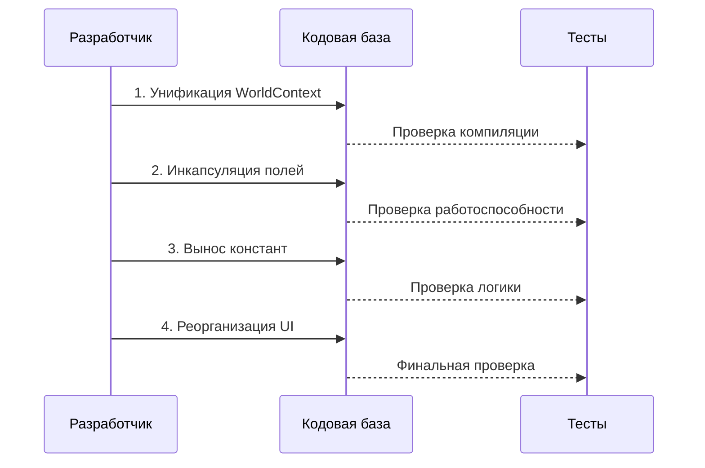

# Дизайн-документ: Рефакторинг архитектуры Go-проекта игры

## Обзор

Рефакторинг направлен на улучшение архитектуры игрового проекта на Go путём устранения дублирования кода, инкапсуляции данных, вынесения магических чисел в константы и реорганизации UI-слоя. Основные цели: унификация интерфейса WorldContext, сокрытие полей структур с добавлением геттеров/сеттеров, улучшение читаемости и поддерживаемости кода.

## Основной алгоритм/Рабочий процесс



## Основные интерфейсы/Типы

### Унифицированный WorldContext

```go
// internal/common/context.go
package common

// WorldContext предоставляет информацию о состоянии игрового мира
type WorldContext interface {
	GetSpeed() float64
	GetWorldOffsetZ() float64
}
```

### Конфигурационные структуры

```go
// internal/config/constants.go
package config

type CameraConfig struct {
	DefaultPositionY float64
	DefaultPositionZ float64
	HorizonRatio     float64
}

type GameConfig struct {
	ScreenWidth    int
	ScreenHeight   int
	DriftThreshold float64
}
```

## Ключевые функции с формальными спецификациями

### Функция 1: UnifyWorldContext()

```go
// Удаляет дублирующий интерфейс WorldContext из internal/world/world.go
func UnifyWorldContext() error
```

**Предусловия:**
- Существует дублирующий интерфейс WorldContext в internal/world/world.go
- Все использования локального WorldContext должны быть заменены на common.WorldContext
- Импорты должны быть обновлены

**Постусловия:**
- В проекте существует только один интерфейс WorldContext (в internal/common/context.go)
- Все файлы используют common.WorldContext
- Код компилируется без ошибок
- Функциональность не изменена

**Инварианты циклов:** N/A

### Функция 2: EncapsulateStructFields()

```go
// Делает поля структур приватными и добавляет геттеры/сеттеры
func EncapsulateStructFields(structName string) error
```

**Предусловия:**
- Структура существует с публичными полями
- Определены целевые структуры: Camera, Segment, World, Layer-типы
- Все внешние обращения к полям должны быть идентифицированы

**Постусловия:**
- Поля структуры приватные (начинаются с маленькой буквы)
- Для каждого поля существует геттер
- Для изменяемых полей существует сеттер
- Все внешние обращения используют геттеры/сеттеры
- Код компилируется и работает корректно

**Инварианты циклов:**
- При обработке каждого поля: все предыдущие поля корректно инкапсулированы
- Состояние структуры остаётся валидным на каждой итерации

### Функция 3: ExtractMagicNumbers()

```go
// Выносит магические числа в константы или конфигурационные структуры
func ExtractMagicNumbers() error
```

**Предусловия:**
- В коде присутствуют магические числа (литералы без объяснения)
- Определены целевые файлы для анализа
- Создан пакет config для констант

**Постусловия:**
- Все магические числа заменены на именованные константы
- Константы сгруппированы логически в config-структурах
- Код более читаем и поддерживаем
- Функциональность не изменена

**Инварианты циклов:**
- Для каждого обработанного файла: все магические числа заменены
- Семантика программы сохраняется

### Функция 4: ReorganizeUILayer()

```go
// Перемещает UI-слой из world в отдельный пакет или рендерит в GameState
func ReorganizeUILayer() error
```

**Предусловия:**
- BalanceBarLayer находится в пакете world
- BalanceBarLayer является UI-элементом, не связанным с игровым миром
- GameState имеет доступ к данным игрока

**Постусловия:**
- BalanceBarLayer перемещён в internal/ui или рендерится напрямую в GameState
- Разделение ответственности: world отвечает за игровой мир, ui за интерфейс
- Код компилируется и UI отображается корректно
- Нет циклических зависимостей

**Инварианты циклов:** N/A

## Алгоритмический псевдокод

### Основной алгоритм рефакторинга

```go
// ALGORITHM RefactorArchitecture
// INPUT: проект Go с текущей структурой
// OUTPUT: рефакторенный проект с улучшенной архитектурой

func RefactorArchitecture(project *Project) error {
	// Шаг 1: Унификация WorldContext
	if err := UnifyWorldContext(project); err != nil {
		return fmt.Errorf("failed to unify WorldContext: %w", err)
	}
	
	// Шаг 2: Инкапсуляция полей структур
	targetStructs := []string{"Camera", "Segment", "World", "SkyLayer", "FarBankLayer", "SegmentLayer"}
	for _, structName := range targetStructs {
		// ASSERT: все предыдущие структуры корректно инкапсулированы
		if err := EncapsulateStructFields(project, structName); err != nil {
			return fmt.Errorf("failed to encapsulate %s: %w", structName, err)
		}
	}
	
	// Шаг 3: Вынос магических чисел
	if err := ExtractMagicNumbers(project); err != nil {
		return fmt.Errorf("failed to extract magic numbers: %w", err)
	}
	
	// Шаг 4: Реорганизация UI-слоя
	if err := ReorganizeUILayer(project); err != nil {
		return fmt.Errorf("failed to reorganize UI layer: %w", err)
	}
	
	// ASSERT: проект компилируется и все тесты проходят
	if err := project.Verify(); err != nil {
		return fmt.Errorf("verification failed: %w", err)
	}
	
	return nil
}
```

**Предусловия:**
- Проект компилируется и работает
- Существует резервная копия или версия в git
- Определены целевые структуры и файлы для рефакторинга

**Постусловия:**
- Все цели рефакторинга достигнуты
- Проект компилируется без ошибок
- Функциональность сохранена
- Код более читаем и поддерживаем

**Инварианты циклов:**
- После каждого шага проект остаётся в компилируемом состоянии
- Функциональность не нарушается на каждой итерации

### Алгоритм унификации WorldContext

```go
// ALGORITHM UnifyWorldContext
// INPUT: проект с дублирующими интерфейсами
// OUTPUT: проект с единым интерфейсом WorldContext

func UnifyWorldContext(project *Project) error {
	// Шаг 1: Найти все определения WorldContext
	definitions := project.FindInterfaceDefinitions("WorldContext")
	
	// ASSERT: найдено как минимум 2 определения
	if len(definitions) < 2 {
		return nil // нет дублирования
	}
	
	// Шаг 2: Определить каноническое определение (в common)
	canonical := definitions.FindInPackage("common")
	if canonical == nil {
		return errors.New("canonical WorldContext not found in common package")
	}
	
	// Шаг 3: Удалить дублирующие определения
	for _, def := range definitions {
		if def.Package != "common" {
			if err := project.RemoveInterfaceDefinition(def); err != nil {
				return err
			}
		}
	}
	
	// Шаг 4: Обновить импорты во всех файлах
	files := project.FindFilesUsingInterface("WorldContext")
	for _, file := range files {
		// ASSERT: файл компилируется
		if err := file.AddImport("TheFiaskoTest/internal/common"); err != nil {
			return err
		}
		if err := file.ReplaceLocalTypeWithImported("WorldContext", "common.WorldContext"); err != nil {
			return err
		}
	}
	
	// ASSERT: проект компилируется
	return project.Compile()
}
```

**Предусловия:**
- Существует интерфейс WorldContext в internal/common/context.go
- Существует дублирующий интерфейс в internal/world/world.go
- Оба интерфейса имеют одинаковую сигнатуру

**Постусловия:**
- Остался только один интерфейс WorldContext в common
- Все файлы импортируют common.WorldContext
- Проект компилируется

**Инварианты циклов:**
- Для каждого обработанного файла: импорты корректны и файл компилируется

### Алгоритм инкапсуляции полей

```go
// ALGORITHM EncapsulateStructFields
// INPUT: структура с публичными полями
// OUTPUT: структура с приватными полями и геттерами/сеттерами

func EncapsulateStructFields(project *Project, structName string) error {
	// Шаг 1: Найти определение структуры
	structDef := project.FindStruct(structName)
	if structDef == nil {
		return fmt.Errorf("struct %s not found", structName)
	}
	
	// Шаг 2: Получить список публичных полей
	publicFields := structDef.GetPublicFields()
	
	// Шаг 3: Для каждого поля создать геттер и сеттер
	for _, field := range publicFields {
		// ASSERT: все предыдущие поля обработаны корректно
		
		// Создать геттер
		getter := GenerateGetter(field)
		if err := structDef.AddMethod(getter); err != nil {
			return err
		}
		
		// Создать сеттер (если поле изменяемое)
		if field.IsMutable {
			setter := GenerateSetter(field)
			if err := structDef.AddMethod(setter); err != nil {
				return err
			}
		}
		
		// Сделать поле приватным
		if err := field.MakePrivate(); err != nil {
			return err
		}
	}
	
	// Шаг 4: Обновить все обращения к полям
	usages := project.FindFieldUsages(structName)
	for _, usage := range usages {
		// ASSERT: usage находится вне пакета структуры
		if usage.IsRead {
			if err := usage.ReplaceWithGetter(); err != nil {
				return err
			}
		}
		if usage.IsWrite {
			if err := usage.ReplaceWithSetter(); err != nil {
				return err
			}
		}
	}
	
	// ASSERT: проект компилируется
	return project.Compile()
}

// Генерация геттера
func GenerateGetter(field *Field) *Method {
	return &Method{
		Name: field.Name,
		Receiver: field.Struct,
		ReturnType: field.Type,
		Body: fmt.Sprintf("return %s.%s", field.Struct.ReceiverName, field.privateName),
	}
}

// Генерация сеттера
func GenerateSetter(field *Field) *Method {
	return &Method{
		Name: "Set" + field.Name,
		Receiver: field.Struct,
		Parameters: []Parameter{{Name: "value", Type: field.Type}},
		Body: fmt.Sprintf("%s.%s = value", field.Struct.ReceiverName, field.privateName),
	}
}
```

**Предусловия:**
- Структура существует с публичными полями
- Определены правила именования геттеров/сеттеров
- Все использования полей могут быть найдены

**Постусловия:**
- Все публичные поля стали приватными
- Для каждого поля существует геттер
- Для изменяемых полей существует сеттер
- Все внешние обращения обновлены
- Проект компилируется

**Инварианты циклов:**
- Для каждого обработанного поля: геттер/сеттер созданы и поле приватное
- Структура остаётся валидной на каждой итерации

### Алгоритм вынесения магических чисел

```go
// ALGORITHM ExtractMagicNumbers
// INPUT: проект с магическими числами в коде
// OUTPUT: проект с именованными константами

func ExtractMagicNumbers(project *Project) error {
	// Шаг 1: Создать пакет config, если не существует
	configPkg := project.GetOrCreatePackage("internal/config")
	
	// Шаг 2: Определить категории констант
	categories := map[string]*ConfigStruct{
		"camera": {
			Name: "CameraConfig",
			Fields: []ConfigField{
				{Name: "DefaultPositionY", Value: 1.5, Type: "float64"},
				{Name: "DefaultPositionZ", Value: -2.0, Type: "float64"},
				{Name: "HorizonRatio", Value: 2.0/3.0, Type: "float64"},
			},
		},
		"game": {
			Name: "GameConfig",
			Fields: []ConfigField{
				{Name: "ScreenWidth", Value: 1266, Type: "int"},
				{Name: "ScreenHeight", Value: 768, Type: "int"},
				{Name: "DriftThreshold", Value: 15.0, Type: "float64"},
			},
		},
		"physics": {
			Name: "PhysicsConfig",
			Fields: []ConfigField{
				{Name: "Gravity", Value: 0.2, Type: "float64"},
			},
		},
	}
	
	// Шаг 3: Создать конфигурационные структуры
	for _, configStruct := range categories {
		// ASSERT: все предыдущие структуры созданы корректно
		if err := configPkg.AddStruct(configStruct); err != nil {
			return err
		}
	}
	
	// Шаг 4: Создать глобальные экземпляры конфигураций
	if err := configPkg.AddGlobalVar("Camera", "CameraConfig", "DefaultCameraConfig()"); err != nil {
		return err
	}
	if err := configPkg.AddGlobalVar("Game", "GameConfig", "DefaultGameConfig()"); err != nil {
		return err
	}
	if err := configPkg.AddGlobalVar("Physics", "PhysicsConfig", "DefaultPhysicsConfig()"); err != nil {
		return err
	}
	
	// Шаг 5: Заменить магические числа в коде
	replacements := []Replacement{
		{File: "internal/render/camera.go", Old: "1.5", New: "config.Camera.DefaultPositionY"},
		{File: "internal/render/camera.go", Old: "-2", New: "config.Camera.DefaultPositionZ"},
		{File: "internal/render/camera.go", Old: "2.0 / 3.0", New: "config.Camera.HorizonRatio"},
		{File: "internal/state/game_state.go", Old: "1266", New: "config.Game.ScreenWidth"},
		{File: "internal/state/game_state.go", Old: "768", New: "config.Game.ScreenHeight"},
		{File: "internal/state/game_state.go", Old: "15.0", New: "config.Game.DriftThreshold"},
		{File: "internal/entity/player.go", Old: "0.2", New: "config.Physics.Gravity"},
	}
	
	for _, repl := range replacements {
		// ASSERT: все предыдущие замены выполнены корректно
		if err := project.ReplaceInFile(repl.File, repl.Old, repl.New); err != nil {
			return err
		}
		// Добавить импорт config
		if err := project.AddImportToFile(repl.File, "TheFiaskoTest/internal/config"); err != nil {
			return err
		}
	}
	
	// ASSERT: проект компилируется
	return project.Compile()
}
```

**Предусловия:**
- В коде присутствуют магические числа
- Определены категории констант
- Создан или может быть создан пакет config

**Постусловия:**
- Все магические числа заменены на именованные константы
- Константы организованы в логические группы (структуры)
- Код более читаем
- Проект компилируется

**Инварианты циклов:**
- Для каждой замены: предыдущие замены корректны и файл компилируется
- Семантика программы не изменяется

### Алгоритм реорганизации UI-слоя

```go
// ALGORITHM ReorganizeUILayer
// INPUT: BalanceBarLayer в пакете world
// OUTPUT: UI-слой в отдельном пакете или рендеринг в GameState

func ReorganizeUILayer(project *Project) error {
	// Вариант 1: Создать отдельный пакет ui
	uiPkg := project.CreatePackage("internal/ui")
	
	// Шаг 1: Переместить BalanceBarLayer в ui
	balanceBarFile := project.GetFile("internal/world/balance_bar.go")
	if err := balanceBarFile.MoveTo("internal/ui/balance_bar.go"); err != nil {
		return err
	}
	
	// Шаг 2: Обновить package declaration
	if err := balanceBarFile.SetPackage("ui"); err != nil {
		return err
	}
	
	// Шаг 3: Удалить зависимость от world.WorldContext
	// BalanceBar не должен реализовывать world.Layer
	if err := balanceBarFile.RemoveInterface("world.Layer"); err != nil {
		return err
	}
	
	// Шаг 4: Упростить интерфейс BalanceBar
	// Убрать параметр WorldContext из Update и Draw
	if err := balanceBarFile.UpdateMethodSignature("Update", "func (b *BalanceBarLayer) Update()"); err != nil {
		return err
	}
	if err := balanceBarFile.UpdateMethodSignature("Draw", "func (b *BalanceBarLayer) Draw(screen *ebiten.Image)"); err != nil {
		return err
	}
	
	// Шаг 5: Обновить GameState для рендеринга UI отдельно
	gameStateFile := project.GetFile("internal/state/game_state.go")
	
	// Удалить добавление balanceLayer в world
	if err := gameStateFile.RemoveCode("w.AddLayer(balanceLayer)"); err != nil {
		return err
	}
	
	// Добавить поле balanceBar в GameState
	if err := gameStateFile.AddField("balanceBar", "*ui.BalanceBarLayer"); err != nil {
		return err
	}
	
	// Инициализировать balanceBar в конструкторе
	initCode := `balanceBar := ui.NewBalanceBarLayer(
		func() float64 { return player.Balance() },
		func() float64 { return player.MaxBalance() },
		func() bool { return player.IsFalling() },
		screenWidth, screenHeight,
	)`
	if err := gameStateFile.AddToConstructor(initCode); err != nil {
		return err
	}
	
	// Рендерить UI после world в Draw
	drawCode := `g.balanceBar.Draw(screen)`
	if err := gameStateFile.AddToMethod("Draw", drawCode, "after world.Draw"); err != nil {
		return err
	}
	
	// Шаг 6: Добавить импорт ui
	if err := gameStateFile.AddImport("TheFiaskoTest/internal/ui"); err != nil {
		return err
	}
	
	// ASSERT: проект компилируется и UI отображается корректно
	return project.Compile()
}
```

**Предусловия:**
- BalanceBarLayer находится в internal/world/balance_bar.go
- BalanceBarLayer реализует world.Layer
- GameState имеет доступ к данным игрока

**Постусловия:**
- BalanceBarLayer перемещён в internal/ui
- UI-слой не зависит от world.Layer
- GameState рендерит UI отдельно от world
- Разделение ответственности: world для игрового мира, ui для интерфейса
- Проект компилируется и UI работает

**Инварианты циклов:** N/A (нет циклов в этом алгоритме)

## Примеры использования

### Пример 1: Использование унифицированного WorldContext

```go
// До рефакторинга (internal/world/world.go)
type WorldContext interface {
	GetSpeed() float64
	GetWorldOffsetZ() float64
}

// После рефакторинга - используется common.WorldContext
import "TheFiaskoTest/internal/common"

func (w *World) Update() {
	w.worldOffsetZ += w.speed
	for _, layer := range w.layers {
		layer.Update(w) // w реализует common.WorldContext
	}
}
```

### Пример 2: Инкапсулированная структура Camera

```go
// До рефакторинга
type Camera struct {
	Position    core.Vec3
	FocalLength float64
	HorizonY    float64
	ScreenW     float64
	ScreenH     float64
}

// Использование
cam.Position.Y = 2.0
cam.FocalLength = 800

// После рефакторинга
type Camera struct {
	position    core.Vec3
	focalLength float64
	horizonY    float64
	screenW     float64
	screenH     float64
}

func (c *Camera) Position() core.Vec3 { return c.position }
func (c *Camera) SetPosition(pos core.Vec3) { c.position = pos }
func (c *Camera) FocalLength() float64 { return c.focalLength }
func (c *Camera) SetFocalLength(fl float64) { c.focalLength = fl }
func (c *Camera) HorizonY() float64 { return c.horizonY }
func (c *Camera) ScreenW() float64 { return c.screenW }
func (c *Camera) ScreenH() float64 { return c.screenH }

// Использование
pos := cam.Position()
pos.Y = 2.0
cam.SetPosition(pos)
cam.SetFocalLength(800)
```

### Пример 3: Использование констант вместо магических чисел

```go
// До рефакторинга (internal/render/camera.go)
func NewCamera(screenW, screenH float64) *Camera {
	return &Camera{
		Position: core.Vec3{
			X: 0,
			Y: 1.5,  // магическое число
			Z: -2,   // магическое число
		},
		FocalLength: screenH,
		HorizonY:    screenH * 2.0 / 3.0,  // магическое число
		ScreenW:     screenW,
		ScreenH:     screenH,
	}
}

// После рефакторинга
import "TheFiaskoTest/internal/config"

func NewCamera(screenW, screenH float64) *Camera {
	return &Camera{
		position: core.Vec3{
			X: 0,
			Y: config.Camera.DefaultPositionY,
			Z: config.Camera.DefaultPositionZ,
		},
		focalLength: screenH,
		horizonY:    screenH * config.Camera.HorizonRatio,
		screenW:     screenW,
		screenH:     screenH,
	}
}
```

### Пример 4: Реорганизованный UI-слой

```go
// До рефакторинга (internal/state/game_state.go)
balanceLayer := world.NewBalanceBarLayer(
	func() float64 { return player.Balance() },
	func() float64 { return player.MaxBalance() },
	func() bool { return player.IsFalling() },
	screenWidth, screenHeight,
)
w.AddLayer(balanceLayer)  // UI смешан с игровым миром

func (g *GameState) Draw(screen *ebiten.Image) {
	g.world.Draw(screen, g.camera)  // UI рисуется внутри world
	g.player.Draw(screen, g.camera, g.world)
}

// После рефакторинга
import "TheFiaskoTest/internal/ui"

balanceBar := ui.NewBalanceBarLayer(
	func() float64 { return player.Balance() },
	func() float64 { return player.MaxBalance() },
	func() bool { return player.IsFalling() },
	screenWidth, screenHeight,
)
// balanceBar НЕ добавляется в world

func (g *GameState) Draw(screen *ebiten.Image) {
	g.world.Draw(screen, g.camera)           // Рисуем игровой мир
	g.player.Draw(screen, g.camera, g.world) // Рисуем игрока
	g.balanceBar.Draw(screen)                // Рисуем UI отдельно
}
```

### Пример 5: Полный рабочий процесс

```go
// Основная функция рефакторинга
func main() {
	project := LoadProject("TheFiaskoTest")
	
	// Шаг 1: Унификация WorldContext
	if err := UnifyWorldContext(project); err != nil {
		log.Fatal(err)
	}
	log.Println("✓ WorldContext унифицирован")
	
	// Шаг 2: Инкапсуляция структур
	structs := []string{"Camera", "Segment", "World", "SkyLayer", "FarBankLayer", "SegmentLayer"}
	for _, s := range structs {
		if err := EncapsulateStructFields(project, s); err != nil {
			log.Fatal(err)
		}
		log.Printf("✓ %s инкапсулирован\n", s)
	}
	
	// Шаг 3: Вынос констант
	if err := ExtractMagicNumbers(project); err != nil {
		log.Fatal(err)
	}
	log.Println("✓ Магические числа вынесены в константы")
	
	// Шаг 4: Реорганизация UI
	if err := ReorganizeUILayer(project); err != nil {
		log.Fatal(err)
	}
	log.Println("✓ UI-слой реорганизован")
	
	// Финальная проверка
	if err := project.Compile(); err != nil {
		log.Fatal("Проект не компилируется:", err)
	}
	log.Println("✓ Рефакторинг завершён успешно")
}
```

## Свойства корректности

*Свойство - это характеристика или поведение, которое должно выполняться для всех валидных выполнений системы - по сути, формальное утверждение о том, что система должна делать. Свойства служат мостом между человеко-читаемыми спецификациями и машинно-проверяемыми гарантиями корректности.*

### Свойство 1: Единственность определения WorldContext

*For any* пакет в проекте, если пакет определяет интерфейс WorldContext, то этот пакет должен быть internal/common, и никакой другой пакет не должен определять WorldContext

**Validates: Requirements 1.1, 1.2**

### Свойство 2: Импорт WorldContext из common

*For any* файл в проекте, если файл использует тип WorldContext, то этот файл должен импортировать пакет internal/common

**Validates: Requirement 1.3**

### Свойство 3: Приватность полей целевых структур

*For any* структура из набора {Camera, Segment, World, SkyLayer, FarBankLayer, SegmentLayer}, все поля этой структуры должны быть приватными (начинаться с маленькой буквы)

**Validates: Requirements 2.1, 3.1, 4.1, 5.1, 5.2, 5.3**

### Свойство 4: Наличие геттеров для всех полей

*For any* структура из набора {Camera, Segment, World, SkyLayer, FarBankLayer, SegmentLayer} и для любого поля этой структуры, должен существовать метод-геттер с именем, соответствующим имени поля с заглавной буквы, возвращающий тип поля

**Validates: Requirements 2.2, 3.2, 4.2, 5.4, 11.1, 11.2**

### Свойство 5: Наличие сеттеров для изменяемых полей

*For any* структура из набора {Camera, Segment, World, SkyLayer, FarBankLayer, SegmentLayer} и для любого изменяемого поля этой структуры, должен существовать метод-сеттер с именем "Set" + имя поля с заглавной буквы, принимающий один параметр типа поля

**Validates: Requirements 2.3, 3.3, 4.3, 5.5, 11.3, 11.4**

### Свойство 6: Внешний доступ только через геттеры и сеттеры

*For any* обращение к полю инкапсулированной структуры из внешнего пакета, это обращение должно происходить через метод-геттер (для чтения) или метод-сеттер (для записи), а не через прямой доступ к полю

**Validates: Requirements 2.4, 2.5, 3.4, 4.4**

### Свойство 7: Замена магических чисел константами

*For any* числовой литерал в файлах {camera.go, game_state.go, player.go}, если литерал не является очевидным (например, 0, 1), то он должен быть заменён на обращение к именованной константе из пакета config

**Validates: Requirements 7.1, 7.2, 7.3**

### Свойство 8: Импорт config при использовании констант

*For any* файл в проекте, если файл содержит обращение к config.Camera, config.Game или config.Physics, то этот файл должен импортировать пакет internal/config

**Validates: Requirement 7.4**

### Свойство 9: Отсутствие циклических зависимостей

*For any* два пакета p1 и p2 в проекте, не должно быть ситуации, когда p1 зависит от p2 И p2 зависит от p1 одновременно

**Validates: Requirements 8.5, 12.1**

### Свойство 10: Компилируемость после каждого шага

*For any* шаг рефакторинга из набора {унификация WorldContext, инкапсуляция структур, вынос констант, реорганизация UI}, после завершения этого шага проект должен компилироваться без ошибок

**Validates: Requirements 1.4, 2.6, 3.5, 4.5, 5.6, 6.6, 7.5, 8.6, 10.1, 10.2, 10.3, 10.4**

## Обработка ошибок

### Сценарий ошибки 1: Конфликт имён при создании геттеров

**Условие**: Существующий метод с таким же именем, как у геттера

**Реакция**: 
- Проверить, является ли существующий метод корректным геттером
- Если да - пропустить создание
- Если нет - добавить префикс "Get" к имени геттера

**Восстановление**: Продолжить обработку остальных полей

### Сценарий ошибки 2: Не найдены все использования поля

**Условие**: Статический анализ не может найти все обращения к полю

**Реакция**:
- Сделать поле приватным
- Попытаться скомпилировать проект
- Ошибки компиляции укажут на пропущенные использования

**Восстановление**: Обработать ошибки компиляции вручную или автоматически

### Сценарий ошибки 3: Магическое число используется в нескольких контекстах

**Условие**: Одно и то же число имеет разное значение в разных местах

**Реакция**:
- Создать отдельные константы для каждого контекста
- Использовать семантические имена, отражающие назначение

**Восстановление**: Проверить корректность замен через тесты

### Сценарий ошибки 4: Циклическая зависимость при перемещении UI

**Условие**: Пакет ui зависит от world, а world от ui

**Реакция**:
- Использовать интерфейсы для разрыва зависимости
- Или рендерить UI напрямую в GameState без создания пакета ui

**Восстановление**: Выбрать альтернативный подход к организации UI

## Стратегия тестирования

### Подход к юнит-тестированию

Для каждого рефакторингового шага создать тесты, проверяющие:

1. **Тесты компиляции**
   - Проект компилируется после каждого шага
   - Нет неиспользуемых импортов
   - Нет неразрешённых символов

2. **Тесты инкапсуляции**
   - Геттеры возвращают корректные значения
   - Сеттеры корректно изменяют состояние
   - Приватные поля недоступны извне пакета

3. **Тесты констант**
   - Значения констант соответствуют оригинальным магическим числам
   - Константы используются во всех нужных местах
   - Семантика программы не изменилась

### Подход к property-based тестированию

**Библиотека**: gopter (Go property testing)

**Свойство 1: Идемпотентность рефакторинга**
```go
// Применение рефакторинга дважды даёт тот же результат
property: Refactor(Refactor(code)) ≡ Refactor(code)
```

**Свойство 2: Сохранение поведения**
```go
// Вывод программы не изменяется после рефакторинга
property: ∀ input: Output(Original(input)) ≡ Output(Refactored(input))
```

**Свойство 3: Инвариант инкапсуляции**
```go
// Геттер всегда возвращает текущее значение поля
property: ∀ struct s, field f: s.Getter(f) ≡ s.field (концептуально)
```

### Подход к интеграционному тестированию

1. **Тест полного игрового цикла**
   - Запустить игру после рефакторинга
   - Проверить, что все системы работают
   - Игрок может двигаться, прыгать, падать
   - UI отображается корректно

2. **Тест рендеринга**
   - Все слои отрисовываются в правильном порядке
   - UI отображается поверх игрового мира
   - Камера работает корректно

3. **Тест физики**
   - Гравитация работает с новыми константами
   - Коллизии обрабатываются правильно
   - Баланс игрока рассчитывается корректно

## Соображения производительности

1. **Геттеры/сеттеры**: В Go вызовы методов инлайнятся компилятором, поэтому накладные расходы минимальны

2. **Константы**: Использование констант вместо литералов не влияет на производительность

3. **Разделение UI**: Рендеринг UI отдельно от world может незначительно улучшить производительность за счёт лучшей локальности кода

4. **Отсутствие аллокаций**: Рефакторинг не должен вводить дополнительные аллокации памяти

## Соображения безопасности

1. **Инкапсуляция**: Приватные поля предотвращают случайное изменение внутреннего состояния

2. **Иммутабельность**: Геттеры возвращают копии данных там, где это необходимо (например, Vec3)

3. **Валидация**: Сеттеры могут включать валидацию входных данных

4. **Разделение ответственности**: UI не может напрямую влиять на игровой мир

## Зависимости

### Внешние библиотеки
- `github.com/hajimehoshi/ebiten/v2` - игровой движок (без изменений)

### Внутренние пакеты

**Новые пакеты**:
- `internal/config` - конфигурационные константы и структуры
- `internal/ui` - UI-компоненты (опционально)

**Изменённые пакеты**:
- `internal/common` - остаётся единственным местом определения WorldContext
- `internal/render` - Camera с приватными полями
- `internal/world` - World, Segment, Layers с приватными полями, без дублирующего WorldContext
- `internal/entity` - использует common.WorldContext
- `internal/state` - использует config константы, рендерит UI отдельно

**Граф зависимостей после рефакторинга**:
```
cmd/game
  └─> internal/state
       ├─> internal/world
       │    ├─> internal/common
       │    └─> internal/render
       ├─> internal/entity
       │    ├─> internal/common
       │    └─> internal/render
       ├─> internal/ui (опционально)
       ├─> internal/render
       └─> internal/config

internal/config (нет зависимостей)
internal/common (нет зависимостей)
internal/core (нет зависимостей)
```

**Отсутствие циклических зависимостей**: ✓
