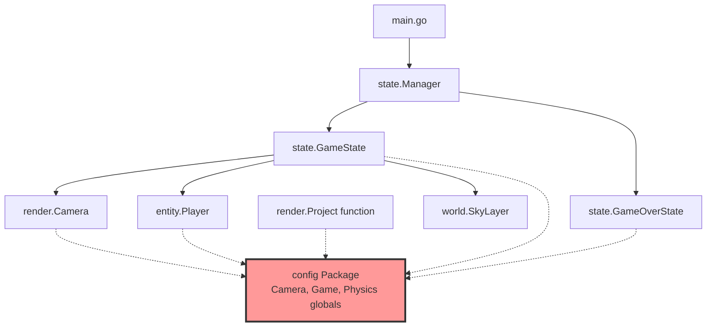
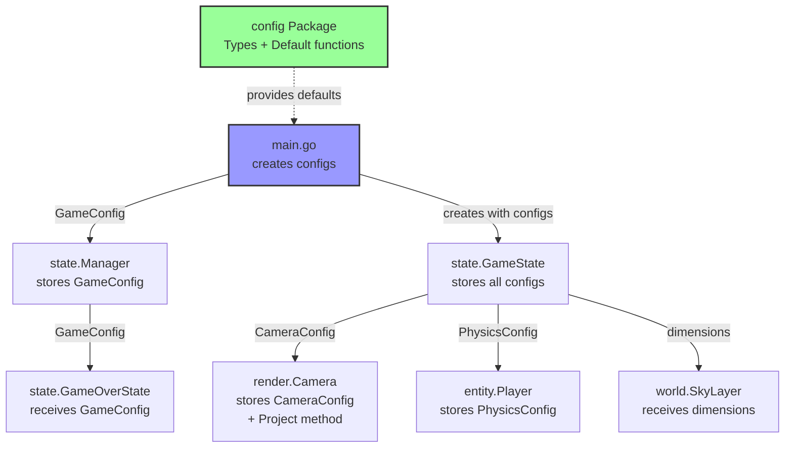

# Design Document: Устранение глобальных переменных конфигурации

## Overview

Данный дизайн описывает рефакторинг системы конфигурации игры для устранения глобальных переменных `config.Camera`, `config.Game` и `config.Physics`. Цель рефакторинга - применить паттерн Dependency Injection, передавая конфигурации явно через конструкторы компонентов.

### Текущая проблема

В текущей реализации пакет `internal/config` экспортирует три глобальные переменные:
- `config.Camera` - конфигурация камеры
- `config.Game` - конфигурация игры (размеры экрана, пороги)
- `config.Physics` - конфигурация физики (гравитация)

Эти переменные используются напрямую в различных компонентах системы:
- `render.Project()` использует `config.Camera` для расчёта искривления перспективы
- `render.NewCamera()` использует `config.Camera` для инициализации позиции
- `GameState` использует `config.Game` для размеров экрана и порога дрейфа
- `GameOverState` использует `config.Game` для позиционирования текста
- `Player.Update()` использует `config.Physics.Gravity` для расчёта прыжка
- `SkyLayer` создаётся с размерами из `config.Game`

### Целевое решение

После рефакторинга:
- Глобальные переменные будут удалены из пакета `config`
- Функции `DefaultCameraConfig()`, `DefaultGameConfig()`, `DefaultPhysicsConfig()` останутся для создания конфигураций по умолчанию
- Каждый компонент будет получать необходимую конфигурацию через конструктор
- Функция `render.Project()` станет методом `Camera.Project()`
- `main.go` создаст конфигурации и передаст их в `Manager` или `GameState`

### Преимущества

1. **Тестируемость**: Компоненты можно тестировать с различными конфигурациями без изменения глобального состояния
2. **Изоляция**: Каждый компонент явно декларирует свои зависимости
3. **Гибкость**: Возможность использовать несколько конфигураций одновременно (например, для split-screen)
4. **Читаемость**: Явные зависимости делают код более понятным

## Architecture

### Диаграмма зависимостей (до рефакторинга)



### Диаграмма зависимостей (после рефакторинга)



### Поток данных конфигурации

1. **Инициализация** (`main.go`):
   ```
   DefaultCameraConfig() → cameraCfg
   DefaultGameConfig() → gameCfg  
   DefaultPhysicsConfig() → physicsCfg
   ```

2. **Создание Manager**:
   ```
   NewManager(gameCfg) → хранит GameConfig для передачи в состояния
   ```

3. **Создание GameState**:
   ```
   NewGameState(manager, gameCfg, cameraCfg, physicsCfg)
   ├─→ NewCamera(screenW, screenH, cameraCfg)
   ├─→ NewPlayer(world, playerCfg{PhysicsConfig: physicsCfg})
   └─→ NewSkyLayer(gameCfg.ScreenWidth, height, speed)
   ```

4. **Использование в runtime**:
   - `Camera.Project()` использует сохранённый `CameraConfig`
   - `Player.Update()` использует сохранённый `PhysicsConfig`
   - `GameState` использует сохранённый `GameConfig`

## Components and Interfaces

### 1. Пакет config (internal/config/constants.go)

#### Изменения

**Удалить**:
```go
var (
    Camera  = DefaultCameraConfig()
    Game    = DefaultGameConfig()
    Physics = DefaultPhysicsConfig()
)
```

**Оставить без изменений**:
- Типы `CameraConfig`, `GameConfig`, `PhysicsConfig`
- Функции `DefaultCameraConfig()`, `DefaultGameConfig()`, `DefaultPhysicsConfig()`

### 2. Структура Camera (internal/render/camera.go)

#### Текущая сигнатура

```go
type Camera struct {
    position    core.Vec3
    focalLength float64
    horizonY    float64
    screenW     float64
    screenH     float64
}

func NewCamera(screenW, screenH float64) *Camera
```

#### Новая сигнатура

```go
type Camera struct {
    position    core.Vec3
    focalLength float64
    horizonY    float64
    screenW     float64
    screenH     float64
    config      config.CameraConfig  // НОВОЕ ПОЛЕ
}

func NewCamera(screenW, screenH float64, cfg config.CameraConfig) *Camera
```

#### Новый метод Project

```go
// Project проецирует 3D точку на экран с учётом конфигурации камеры
func (c *Camera) Project(point core.Vec3) (float64, float64, float64) {
    // Переводим в координаты камеры
    relX := point.X - c.position.X
    relY := point.Y - c.position.Y
    relZ := point.Z - c.position.Z

    if relZ <= 0.1 {
        return 0, 0, 0
    }

    // Базовая перспективная проекция
    scale := c.focalLength / relZ

    // === ГОРИЗОНТАЛЬНОЕ ИСКРИВЛЕНИЕ (влево) ===
    curveOffset := 0.0
    if c.config.CurveStrength > 0 && c.config.CurveDepth > 0 {
        normalizedDepth := math.Min(relZ/c.config.CurveDepth, 1.0)
        curveOffset = -c.config.CurveStrength * normalizedDepth * normalizedDepth * c.screenW
    }

    // === ВЕРТИКАЛЬНОЕ ИСКРИВЛЕНИЕ (подъём и опускание) ===
    verticalOffset := 0.0
    if c.config.VerticalCurveStrength > 0 && c.config.CurveDepth > 0 {
        normalizedDepth := math.Min(relZ/c.config.CurveDepth, 1.0)
        peakPoint := c.config.VerticalCurvePeak

        if normalizedDepth <= peakPoint {
            t := normalizedDepth / peakPoint
            verticalOffset = c.config.VerticalCurveStrength * t * (2.0 - t) * c.screenH
        } else {
            t := (normalizedDepth - peakPoint) / (1.0 - peakPoint)
            dropAmount := c.config.VerticalCurveDrop * t * t
            riseAmount := c.config.VerticalCurveStrength * (1.0 - t)
            verticalOffset = (riseAmount - dropAmount) * c.screenH
        }
    }

    screenX := c.screenW/2 + relX*scale + curveOffset
    screenY := c.horizonY - relY*scale - verticalOffset

    return screenX, screenY, scale
}
```

#### Реализация конструктора

```go
func NewCamera(screenW, screenH float64, cfg config.CameraConfig) *Camera {
    return &Camera{
        position: core.Vec3{
            X: 0,
            Y: cfg.DefaultPositionY,
            Z: cfg.DefaultPositionZ,
        },
        focalLength: screenH,
        horizonY:    screenH * cfg.HorizonRatio,
        screenW:     screenW,
        screenH:     screenH,
        config:      cfg,  // Сохраняем конфигурацию
    }
}
```

### 3. Удаление функции render.Project (internal/render/projection.go)

Файл `internal/render/projection.go` будет **полностью удалён**, так как функция `Project` станет методом `Camera`.

### 4. Структура Player (internal/entity/player.go)

#### Текущая сигнатура

```go
type PlayerConfig struct {
    StartX, StartZ, Width, Height float64
    BalanceSpeed                  float64
}

type Player struct {
    world        *world.World
    position     core.Vec3
    width        float64
    height       float64
    // ... другие поля
}

func NewPlayer(world *world.World, cfg PlayerConfig) *Player
```

#### Новая сигнатура

```go
type PlayerConfig struct {
    StartX, StartZ, Width, Height float64
    BalanceSpeed                  float64
    Physics                       config.PhysicsConfig  // НОВОЕ ПОЛЕ
}

type Player struct {
    world        *world.World
    position     core.Vec3
    width        float64
    height       float64
    physics      config.PhysicsConfig  // НОВОЕ ПОЛЕ
    // ... другие поля
}

func NewPlayer(world *world.World, cfg PlayerConfig) *Player
```

#### Изменения в методе Update

```go
func (p *Player) Update(ctx common.WorldContext) {
    // ... существующий код ...

    if p.isJumping {
        p.position.Y += p.jumpVelocity
        p.jumpVelocity -= p.physics.Gravity  // Используем сохранённую конфигурацию
        if p.position.Y <= p.groundY {
            p.position.Y = p.groundY
            p.isJumping = false
            p.jumpVelocity = 0
        }
    } else {
        p.position.Y = p.groundY
    }
}
```

#### Изменения в методе Draw

```go
func (p *Player) Draw(screen *ebiten.Image, cam *render.Camera, ctx common.WorldContext) {
    relative := p.position

    bottom := core.Vec3{X: relative.X, Y: relative.Y, Z: relative.Z}
    top := core.Vec3{X: relative.X, Y: relative.Y + p.height, Z: relative.Z}

    // Используем метод камеры вместо функции
    bx, by, bScale := cam.Project(bottom)
    _, ty, tScale := cam.Project(top)

    if bScale <= 0 || tScale <= 0 {
        return
    }

    scale := (bScale + tScale) / 2
    screenWidth := p.width * scale
    halfW := screenWidth / 2

    ebitenutil.DrawRect(screen, bx-halfW, ty, screenWidth, by-ty, p.color)
}
```

### 5. Структура GameState (internal/state/game_state.go)

#### Текущая сигнатура

```go
type GameState struct {
    manager    *Manager
    world      *world.World
    camera     *render.Camera
    player     *entity.Player
    balanceBar *ui.BalanceBarLayer
    score      float64
    driftDir   int
}

func NewGameState(manager *Manager) *GameState
```

#### Новая сигнатура

```go
type GameState struct {
    manager    *Manager
    world      *world.World
    camera     *render.Camera
    player     *entity.Player
    balanceBar *ui.BalanceBarLayer
    score      float64
    driftDir   int
    gameConfig config.GameConfig  // НОВОЕ ПОЛЕ
}

func NewGameState(
    manager *Manager,
    gameCfg config.GameConfig,
    cameraCfg config.CameraConfig,
    physicsCfg config.PhysicsConfig,
) *GameState
```

#### Реализация конструктора

```go
func NewGameState(
    manager *Manager,
    gameCfg config.GameConfig,
    cameraCfg config.CameraConfig,
    physicsCfg config.PhysicsConfig,
) *GameState {
    w := world.New(0.5)

    // Создаём слои с явными размерами
    skyLayer := world.NewSkyLayer(gameCfg.ScreenWidth, 300, 0.1)
    w.AddLayer(skyLayer)

    farBankLayer := world.NewFarBankLayer(300, 50)
    w.AddLayer(farBankLayer)

    logLayer := world.NewSegmentLayer(
        0, -20, 10, 40, 2.0, 20,
        0.0, 0.30,
        color.RGBA{139, 69, 19, 255}, world.SurfaceSolid,
    )
    w.AddLayer(logLayer)

    riverLayer := world.NewSegmentLayer(
        0, -25, 2000, 40, 0.3, 20,
        0.0, 0.25,
        color.RGBA{0, 100, 255, 255}, world.SurfaceLiquid,
    )
    w.AddLayer(riverLayer)

    // Игрок с конфигурацией физики
    player := entity.NewPlayer(w, entity.PlayerConfig{
        StartX:       0,
        StartZ:       50,
        Width:        4.0,
        Height:       8.0,
        BalanceSpeed: 0.2,
        Physics:      physicsCfg,  // Передаём конфигурацию физики
    })

    // Слой баланса с явными размерами
    balanceBar := ui.NewBalanceBarLayer(
        func() float64 { return player.Balance() },
        func() float64 { return player.MaxBalance() },
        func() bool { return player.IsFalling() },
        float64(gameCfg.ScreenWidth),
        float64(gameCfg.ScreenHeight),
    )

    return &GameState{
        manager:    manager,
        world:      w,
        camera:     render.NewCamera(float64(gameCfg.ScreenWidth), float64(gameCfg.ScreenHeight), cameraCfg),
        player:     player,
        balanceBar: balanceBar,
        score:      0,
        driftDir:   1,
        gameConfig: gameCfg,  // Сохраняем конфигурацию
    }
}
```

#### Изменения в методе Update

```go
func (g *GameState) Update() error {
    g.world.Update()

    // Используем сохранённую конфигурацию
    if g.score >= g.gameConfig.DriftThreshold {
        if inpututil.IsKeyJustPressed(ebiten.KeyA) {
            g.driftDir = -1
        }
        if inpututil.IsKeyJustPressed(ebiten.KeyD) {
            g.driftDir = 1
        }
    }

    effectiveDrift := 0
    if g.score >= g.gameConfig.DriftThreshold {
        effectiveDrift = g.driftDir
    }
    g.player.ApplyBalanceInput(effectiveDrift)

    if inpututil.IsKeyJustPressed(ebiten.KeyW) {
        g.player.Jump(2.5)
    }

    g.player.Update(g.world)

    if !g.player.IsFalling() {
        tps := ebiten.ActualTPS()
        if tps == 0 {
            tps = 60
        }
        g.score += 10.0 / tps
    } else {
        gameOver := NewGameOverState(g.manager, g.score, g.gameConfig)
        g.manager.ChangeState(gameOver, nil)
    }

    return nil
}
```

#### Изменения в методе Draw

```go
func (g *GameState) Draw(screen *ebiten.Image) {
    g.world.Draw(screen, g.camera)
    g.player.Draw(screen, g.camera, g.world)

    g.balanceBar.Draw(screen)

    balanceText := fmt.Sprintf("Balance: %.2f / %.0f", g.player.Balance(), g.player.MaxBalance())
    ebitenutil.DebugPrintAt(screen, balanceText, 10, 10)
    ebitenutil.DebugPrintAt(screen, fmt.Sprintf("Score: %.0f", g.score), 10, 30)

    if g.score >= g.gameConfig.DriftThreshold {
        dirStr := "RIGHT"
        if g.driftDir == -1 {
            dirStr = "LEFT"
        }
        ebitenutil.DebugPrintAt(screen, "Drift direction: "+dirStr+" (A/D to change)", 10, 50)
    } else {
        ebitenutil.DebugPrintAt(screen, fmt.Sprintf("Stable (need %.0f points)", g.gameConfig.DriftThreshold), 10, 50)
    }
}
```

### 6. Структура GameOverState (internal/state/gameover_state.go)

#### Текущая сигнатура

```go
type GameOverState struct {
    manager *Manager
    score   float64
}

func NewGameOverState(manager *Manager, score float64) *GameOverState
```

#### Новая сигнатура

```go
type GameOverState struct {
    manager    *Manager
    score      float64
    gameConfig config.GameConfig  // НОВОЕ ПОЛЕ
}

func NewGameOverState(manager *Manager, score float64, gameCfg config.GameConfig) *GameOverState
```

#### Реализация

```go
func NewGameOverState(manager *Manager, score float64, gameCfg config.GameConfig) *GameOverState {
    return &GameOverState{
        manager:    manager,
        score:      score,
        gameConfig: gameCfg,
    }
}

func (g *GameOverState) Update() error {
    if inpututil.IsKeyJustPressed(ebiten.KeyEnter) {
        // Получаем конфигурации из manager
        cameraCfg := config.DefaultCameraConfig()
        physicsCfg := config.DefaultPhysicsConfig()
        gameState := NewGameState(g.manager, g.gameConfig, cameraCfg, physicsCfg)
        g.manager.ChangeState(gameState, nil)
    }
    if inpututil.IsKeyJustPressed(ebiten.KeyEscape) {
        menuState := NewMenuState(g.manager)
        g.manager.ChangeState(menuState, nil)
    }
    return nil
}

func (g *GameOverState) Draw(screen *ebiten.Image) {
    screen.Fill(color.RGBA{0, 0, 0, 255})
    msg := fmt.Sprintf("GAME OVER\nScore: %.0f\nPress ENTER to restart\nPress ESC for menu", g.score)
    // Используем сохранённую конфигурацию
    ebitenutil.DebugPrintAt(screen, msg, g.gameConfig.ScreenWidth/2-100, g.gameConfig.ScreenHeight/2-40)
}
```

### 7. Структура Manager (internal/state/manager.go)

Для упрощения передачи конфигураций между состояниями, Manager может хранить GameConfig:

```go
type Manager struct {
    currentState State
    gameConfig   config.GameConfig  // НОВОЕ ПОЛЕ
}

func NewManager(initialState State, gameCfg config.GameConfig) *Manager {
    return &Manager{
        currentState: initialState,
        gameConfig:   gameCfg,
    }
}

// GameConfig возвращает конфигурацию игры
func (m *Manager) GameConfig() config.GameConfig {
    return m.gameConfig
}
```

### 8. Обновление main.go

```go
package main

import (
    "log"

    "github.com/hajimehoshi/ebiten/v2"

    "TheFiaskoTest/internal/config"
    "TheFiaskoTest/internal/state"
)

func main() {
    // Создаём конфигурации
    gameCfg := config.DefaultGameConfig()
    cameraCfg := config.DefaultCameraConfig()
    physicsCfg := config.DefaultPhysicsConfig()

    // Создаём менеджер с конфигурацией игры
    manager := state.NewManager(nil, gameCfg)
    
    // Создаём начальное состояние
    menuState := state.NewMenuState(manager)
    manager.ChangeState(menuState, nil)

    game := &Game{manager: manager}

    ebiten.SetWindowSize(gameCfg.ScreenWidth, gameCfg.ScreenHeight)
    ebiten.SetWindowTitle("The Fiasko")
    if err := ebiten.RunGame(game); err != nil {
        log.Fatal(err)
    }
}

type Game struct {
    manager *state.Manager
}

func (g *Game) Update() error {
    return g.manager.Update()
}

func (g *Game) Draw(screen *ebiten.Image) {
    g.manager.Draw(screen)
}

func (g *Game) Layout(outsideWidth, outsideHeight int) (int, int) {
    cfg := g.manager.GameConfig()
    return cfg.ScreenWidth, cfg.ScreenHeight
}
```

### 9. Обновление всех вызовов render.Project

Все места, где вызывается `render.Project(point, cam)`, должны быть заменены на `cam.Project(point)`.

Примеры файлов для обновления:
- `internal/entity/player.go` - метод `Draw`
- `internal/world/*.go` - любые слои, использующие проекцию

## Data Models

### Конфигурационные структуры

Структуры данных остаются без изменений:

```go
// CameraConfig - конфигурация камеры
type CameraConfig struct {
    DefaultPositionY      float64
    DefaultPositionZ      float64
    HorizonRatio          float64
    CurveStrength         float64
    CurveDepth            float64
    VerticalCurveStrength float64
    VerticalCurvePeak     float64
    VerticalCurveDrop     float64
}

// GameConfig - конфигурация игры
type GameConfig struct {
    ScreenWidth    int
    ScreenHeight   int
    DriftThreshold float64
}

// PhysicsConfig - конфигурация физики
type PhysicsConfig struct {
    Gravity float64
}
```

### Расширенные структуры компонентов

```go
// Camera с конфигурацией
type Camera struct {
    position    core.Vec3
    focalLength float64
    horizonY    float64
    screenW     float64
    screenH     float64
    config      config.CameraConfig  // Добавлено
}

// Player с конфигурацией физики
type Player struct {
    world        *world.World
    position     core.Vec3
    width        float64
    height       float64
    color        color.Color
    isJumping    bool
    jumpVelocity float64
    groundY      float64
    balance      float64
    maxBalance   float64
    balanceSpeed float64
    isFalling    bool
    physics      config.PhysicsConfig  // Добавлено
}

// PlayerConfig с конфигурацией физики
type PlayerConfig struct {
    StartX, StartZ, Width, Height float64
    BalanceSpeed                  float64
    Physics                       config.PhysicsConfig  // Добавлено
}

// GameState с конфигурацией игры
type GameState struct {
    manager    *Manager
    world      *world.World
    camera     *render.Camera
    player     *entity.Player
    balanceBar *ui.BalanceBarLayer
    score      float64
    driftDir   int
    gameConfig config.GameConfig  // Добавлено
}

// GameOverState с конфигурацией игры
type GameOverState struct {
    manager    *Manager
    score      float64
    gameConfig config.GameConfig  // Добавлено
}

// Manager с конфигурацией игры
type Manager struct {
    currentState State
    gameConfig   config.GameConfig  // Добавлено
}
```


## Correctness Properties

A property is a characteristic or behavior that should hold true across all valid executions of a system-essentially, a formal statement about what the system should do. Properties serve as the bridge between human-readable specifications and machine-verifiable correctness guarantees.

### Property Reflection

Из prework анализа выявлено 3 потенциально тестируемых свойства:
1. Компоненты сохраняют переданную конфигурацию (2.4)
2. Метод Project производит идентичные расчёты (3.4)
3. GameState использует сохранённый DriftThreshold (4.3)
4. Player использует сохранённую Gravity (5.2)

Анализ избыточности:
- Свойство 1 (сохранение конфигурации) является базовым и проверяется через свойства 2, 3, 4 - если компоненты используют правильные значения, значит они их сохранили. Свойство 1 избыточно.
- Свойства 2, 3, 4 проверяют разные аспекты поведения и не пересекаются - все три необходимы.

Итоговые свойства после reflection: 3 уникальных свойства.

### Property 1: Projection calculation equivalence

*For any* 3D point and camera configuration, when the refactored `Camera.Project()` method is called, it SHALL produce identical screen coordinates (x, y, scale) to the original `render.Project()` function given the same inputs.

**Validates: Requirements 3.4, 8.3**

**Rationale**: Это критическое свойство гарантирует, что рефакторинг не изменил математику проекции. Проверяется путём сравнения выходов старой и новой реализации на множестве случайных входных данных (позиции точек, конфигурации камеры).

**Test approach**: Property-based test генерирует случайные:
- Позиции точек (Vec3)
- Параметры CameraConfig (CurveStrength, CurveDepth, VerticalCurveStrength, etc.)
- Размеры экрана (screenW, screenH)

Для каждой комбинации вызывает обе реализации и сравнивает результаты с допуском на погрешность вычислений с плавающей точкой (epsilon = 1e-10).

### Property 2: Drift threshold configuration independence

*For any* valid GameConfig with different DriftThreshold values, when GameState is created with that configuration, the drift mechanics SHALL activate at the score equal to the configured threshold, not at any hardcoded value.

**Validates: Requirements 4.3**

**Rationale**: Это свойство гарантирует, что GameState действительно использует переданную конфигурацию, а не глобальную переменную или hardcoded значение. Проверяется путём создания GameState с различными порогами и симуляции достижения этих порогов.

**Test approach**: Property-based test генерирует случайные значения DriftThreshold (например, от 50 до 500). Для каждого значения:
1. Создаёт GameState с этим порогом
2. Симулирует игру до достижения порога
3. Проверяет, что drift mechanics активируется именно при достижении настроенного порога

### Property 3: Gravity configuration independence

*For any* valid PhysicsConfig with different Gravity values, when Player performs a jump with fixed initial velocity, the jump trajectory (height over time) SHALL be determined by the configured gravity value, not by any hardcoded constant.

**Validates: Requirements 5.2, 8.2**

**Rationale**: Это свойство гарантирует, что Player использует переданную конфигурацию физики. Проверяется путём создания игроков с различными значениями гравитации и сравнения траекторий прыжков.

**Test approach**: Property-based test генерирует случайные значения Gravity (например, от 0.1 до 1.0). Для каждого значения:
1. Создаёт Player с этой гравитацией
2. Инициирует прыжок с фиксированной начальной скоростью
3. Симулирует несколько кадров обновления
4. Проверяет, что изменение высоты соответствует формуле: `velocity -= gravity` на каждом шаге
5. Проверяет, что время полёта обратно пропорционально гравитации

**Edge case**: При gravity = 0 прыжок должен продолжаться бесконечно (игрок не падает).


## Error Handling

### Конфигурационные ошибки

Поскольку конфигурации создаются через функции `Default*Config()`, которые возвращают валидные значения, ошибки конфигурации маловероятны. Однако следует учитывать:

1. **Нулевые или отрицательные размеры экрана**:
   - Конструкторы `NewCamera` и `NewGameState` предполагают положительные размеры
   - Рекомендация: Добавить валидацию в конструкторы или документировать preconditions

2. **Экстремальные значения CurveStrength/CurveDepth**:
   - Очень большие значения могут привести к артефактам рендеринга
   - Текущее поведение: Математика остаётся корректной, но визуальный результат может быть неожиданным
   - Решение: Документировать рекомендуемые диапазоны значений

3. **Нулевая или отрицательная гравитация**:
   - Gravity = 0: Игрок будет прыгать бесконечно (не падает)
   - Gravity < 0: Игрок будет ускоряться вверх
   - Решение: Это валидные сценарии для тестирования или специальных режимов игры

### Ошибки времени выполнения

Рефакторинг не вводит новых источников ошибок времени выполнения:
- Все конфигурации передаются по значению (value types), исключая nil pointer dereference
- Математические операции остаются идентичными оригинальным

### Обработка отсутствующих конфигураций

Если по какой-то причине конфигурация не передана (например, при расширении системы):
- Go паника при попытке доступа к полю нулевой структуры
- Рекомендация: Использовать функции `Default*Config()` как fallback в конструкторах

Пример защитного программирования (опционально):

```go
func NewCamera(screenW, screenH float64, cfg config.CameraConfig) *Camera {
    // Если передана нулевая конфигурация, используем default
    if cfg.CurveDepth == 0 && cfg.HorizonRatio == 0 {
        cfg = config.DefaultCameraConfig()
    }
    // ... остальной код
}
```

## Testing Strategy

### Dual Testing Approach

Тестирование рефакторинга будет использовать комбинацию unit-тестов и property-based тестов:

- **Unit tests**: Проверка конкретных примеров, edge cases, интеграции компонентов
- **Property tests**: Проверка универсальных свойств на множестве случайных входных данных

### Unit Testing

Unit-тесты сосредоточены на:

1. **Конструкторы компонентов**:
   ```go
   func TestNewCamera_StoresConfiguration(t *testing.T) {
       cfg := config.CameraConfig{
           DefaultPositionY: 2.0,
           CurveStrength: 0.05,
       }
       cam := render.NewCamera(800, 600, cfg)
       
       // Проверяем, что позиция инициализирована из конфигурации
       assert.Equal(t, 2.0, cam.Position().Y)
   }
   ```

2. **Интеграция GameState**:
   ```go
   func TestGameState_UsesDriftThreshold(t *testing.T) {
       gameCfg := config.DefaultGameConfig()
       gameCfg.DriftThreshold = 100.0
       
       gs := state.NewGameState(manager, gameCfg, cameraCfg, physicsCfg)
       
       // Симулируем достижение порога
       // Проверяем активацию drift mechanics
   }
   ```

3. **Edge cases**:
   - Проекция точек за камерой (relZ <= 0.1)
   - Прыжок при нулевой гравитации
   - Экстремальные значения конфигурации

4. **Регрессионные тесты**:
   - Конкретные сценарии из оригинальной реализации
   - Известные позиции точек и ожидаемые координаты экрана

### Property-Based Testing

Для property-based тестирования будет использоваться библиотека **gopter** (Go Property Testing).

#### Конфигурация тестов

Каждый property test должен выполнять минимум **100 итераций** для обеспечения достаточного покрытия случайными данными.

#### Property Test 1: Projection Equivalence

```go
// Feature: remove-global-config-state, Property 1: Projection calculation equivalence
func TestProperty_ProjectionEquivalence(t *testing.T) {
    parameters := gopter.DefaultTestParameters()
    parameters.MinSuccessfulTests = 100
    
    properties := gopter.NewProperties(parameters)
    
    properties.Property("Camera.Project produces identical results to render.Project", 
        prop.ForAll(
            func(point core.Vec3, cfg config.CameraConfig, screenW, screenH float64) bool {
                // Создаём камеру с новой реализацией
                newCam := render.NewCamera(screenW, screenH, cfg)
                newX, newY, newScale := newCam.Project(point)
                
                // Вызываем старую реализацию (сохранённую для тестирования)
                oldX, oldY, oldScale := render.ProjectOld(point, newCam, cfg)
                
                // Сравниваем с допуском на погрешность
                epsilon := 1e-10
                return math.Abs(newX-oldX) < epsilon &&
                       math.Abs(newY-oldY) < epsilon &&
                       math.Abs(newScale-oldScale) < epsilon
            },
            genVec3(),
            genCameraConfig(),
            gen.Float64Range(100, 2000),  // screenW
            gen.Float64Range(100, 2000),  // screenH
        ))
    
    properties.TestingRun(t)
}
```

#### Property Test 2: Drift Threshold Independence

```go
// Feature: remove-global-config-state, Property 2: Drift threshold configuration independence
func TestProperty_DriftThresholdIndependence(t *testing.T) {
    parameters := gopter.DefaultTestParameters()
    parameters.MinSuccessfulTests = 100
    
    properties := gopter.NewProperties(parameters)
    
    properties.Property("GameState activates drift at configured threshold",
        prop.ForAll(
            func(threshold float64) bool {
                gameCfg := config.DefaultGameConfig()
                gameCfg.DriftThreshold = threshold
                
                gs := createTestGameState(gameCfg)
                
                // Симулируем игру до порога - 1
                gs.SetScore(threshold - 1)
                driftActiveBefore := gs.IsDriftActive()
                
                // Симулируем достижение порога
                gs.SetScore(threshold)
                driftActiveAt := gs.IsDriftActive()
                
                // Drift должен быть неактивен до порога и активен при достижении
                return !driftActiveBefore && driftActiveAt
            },
            gen.Float64Range(50, 500),  // threshold
        ))
    
    properties.TestingRun(t)
}
```

#### Property Test 3: Gravity Independence

```go
// Feature: remove-global-config-state, Property 3: Gravity configuration independence
func TestProperty_GravityIndependence(t *testing.T) {
    parameters := gopter.DefaultTestParameters()
    parameters.MinSuccessfulTests = 100
    
    properties := gopter.NewProperties(parameters)
    
    properties.Property("Player jump trajectory depends on configured gravity",
        prop.ForAll(
            func(gravity float64) bool {
                if gravity <= 0 {
                    return true // Skip invalid gravity values
                }
                
                physicsCfg := config.PhysicsConfig{Gravity: gravity}
                player := createTestPlayer(physicsCfg)
                
                initialVelocity := 2.5
                player.Jump(initialVelocity)
                
                // Симулируем несколько кадров
                expectedVelocity := initialVelocity
                for i := 0; i < 10; i++ {
                    player.Update(testContext)
                    expectedVelocity -= gravity
                    
                    // Проверяем, что скорость изменяется согласно гравитации
                    actualVelocity := player.JumpVelocity()
                    if math.Abs(actualVelocity - expectedVelocity) > 1e-6 {
                        return false
                    }
                    
                    if player.Position().Y <= player.GroundY() {
                        break // Приземлился
                    }
                }
                
                return true
            },
            gen.Float64Range(0.1, 1.0),  // gravity
        ))
    
    properties.TestingRun(t)
}
```

#### Генераторы для property tests

```go
// Генератор случайных 3D точек
func genVec3() gopter.Gen {
    return gopter.CombineGens(
        gen.Float64Range(-1000, 1000),  // X
        gen.Float64Range(-10, 10),      // Y
        gen.Float64Range(0.1, 2000),    // Z (положительная глубина)
    ).Map(func(values []interface{}) core.Vec3 {
        return core.Vec3{
            X: values[0].(float64),
            Y: values[1].(float64),
            Z: values[2].(float64),
        }
    })
}

// Генератор случайных конфигураций камеры
func genCameraConfig() gopter.Gen {
    return gopter.CombineGens(
        gen.Float64Range(0.5, 3.0),     // DefaultPositionY
        gen.Float64Range(-5.0, 0),      // DefaultPositionZ
        gen.Float64Range(0.5, 0.9),     // HorizonRatio
        gen.Float64Range(0, 0.1),       // CurveStrength
        gen.Float64Range(500, 2000),    // CurveDepth
        gen.Float64Range(0, 0.1),       // VerticalCurveStrength
        gen.Float64Range(0.5, 0.8),     // VerticalCurvePeak
        gen.Float64Range(0, 0.1),       // VerticalCurveDrop
    ).Map(func(values []interface{}) config.CameraConfig {
        return config.CameraConfig{
            DefaultPositionY:      values[0].(float64),
            DefaultPositionZ:      values[1].(float64),
            HorizonRatio:          values[2].(float64),
            CurveStrength:         values[3].(float64),
            CurveDepth:            values[4].(float64),
            VerticalCurveStrength: values[5].(float64),
            VerticalCurvePeak:     values[6].(float64),
            VerticalCurveDrop:     values[7].(float64),
        }
    })
}
```

### Тестирование миграции

Для обеспечения корректности рефакторинга:

1. **Сохранить старую реализацию**: Временно сохранить функцию `render.Project` как `render.ProjectOld` для сравнительного тестирования

2. **Запустить property tests**: Убедиться, что все свойства выполняются

3. **Запустить существующие тесты**: Все существующие unit и integration тесты должны проходить без изменений

4. **Визуальное тестирование**: Запустить игру и визуально проверить, что рендеринг идентичен

5. **Удалить старую реализацию**: После успешного прохождения всех тестов удалить `ProjectOld`

### Покрытие тестами

Целевое покрытие:
- **Unit tests**: Все конструкторы, основные методы, edge cases
- **Property tests**: 3 критических свойства с минимум 100 итерациями каждое
- **Integration tests**: Полный цикл создания GameState и симуляции игры

### Continuous Integration

Рекомендуется настроить CI pipeline:
1. Запуск всех unit tests
2. Запуск property-based tests с увеличенным числом итераций (500-1000) для более глубокой проверки
3. Проверка отсутствия ссылок на глобальные переменные (grep/regex)
4. Проверка покрытия кода

